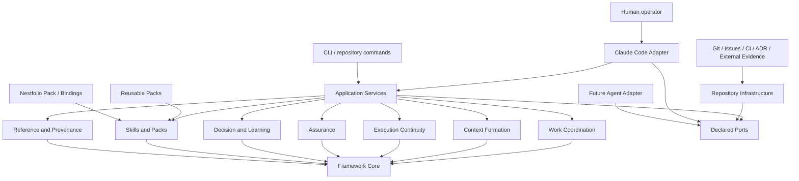

# Target Architecture

## 1. Purpose, authority, and TA-002 result

This artifact is the accepted L3 target architecture produced by **TA-002 — Target Architecture Revision**.

It replaces TA-001 as the active implementation and validation baseline while preserving TA-001 decisions and rejected material in the Decision Records and in the salvage matrix below.

The architecture answers:

> What target architecture allows Continuity to operate as a practical Claude Code-first framework for continuous agentic development on complex repositories, while remaining transferable to other projects and avoiding unnecessary coupling between the universal framework, Claude Code integration, reusable procedures, and Nestfolio-specific behavior?

The operational loop is:

```text
select work
→ form context
→ execute through skills and agents
→ checkpoint or resume
→ validate
→ attach evidence
→ update work state
→ record learning
→ continue
```

TA-002 makes no implementation-code or migration decision. It defines **VS-001 — Resumable Agent Work Session** as the sole next architecture-validation slice.

## 2. Authorization verification

TA-002 began only after Program State was verified to record all required conditions:

- PI-001 completed;
- RI-001 completed and G2 still valid;
- TA-001 provisional and not an implementation baseline;
- G3 reopened;
- TA-002 the sole authorized next iteration.

No Nestfolio source inspection was required. The validated Current Runtime Map contains sufficient evidence for every architectural classification made here.

## 3. Architectural thesis

Continuity is a **repository-native application framework for agent work**, not a universal engineering control plane.

Its target shape has four dependency rings:

1. **Framework Core** — portable domain semantics and lifecycle rules.
2. **Application Services** — concrete use cases coordinating Core aggregates through declared ports.
3. **Repository Infrastructure** — artifact stores, operational state, Git/repository inspection, indexes, leases, and recovery.
4. **Adapters and Packs** — Claude Code integration, future agent adapters, reusable procedures, technology/organization Packs, Nestfolio bindings, and selective external integrations.



The Core never imports Claude Code or Nestfolio semantics. Claude Code is nevertheless a first-class practical adapter, not an afterthought hidden behind theoretical executor neutrality.

Decision references:

- `DR-0013` — bounded agent-work Core with first-class Runs;
- `DR-0014` — repository-local canonical artifacts and declared operational state;
- `DR-0015` — typed concrete integration ports and Claude Code adapter;
- `DR-0016` — Pack manifests, procedures, and executor assets;
- `DR-0017` — governed Assurance and Learning promotion;
- `DR-0018` — VS-001 before broader migration.

## 4. TA-001 salvage matrix

Every significant TA-001 element is explicitly dispositioned. `Retain` means the responsibility survives without a structural change. `Revise` means the useful concept survives with a changed boundary or lifecycle. The `move` classifications identify the authoritative TA-002 destination.

| TA-001 element | Original responsibility | Classification | Reason | Required change | TA-002 destination | Affected DR |
|---|---|---|---|---|---|---|
| Context Pack/Handoff-only architectural thesis | Define the product around two durable aggregates | revise | Context Pack and Handoff remain necessary but no longer define the complete product | Place them inside Work, Run, Assurance, and Learning loop | Context Formation and Execution Continuity | DR-0007, DR-0013 |
| Context Formation bounded context | Form reproducible objective-specific context | retain | Directly compatible with corrected product premise | Bind formation to Work Item, Working Set, Session, and Run | Context Formation | DR-0011 |
| Handoff bounded context | Publish durable continuation contracts | retain | Still required at session, executor, owner, and iteration boundaries | Include Run, Checkpoint, work state, and Evidence references | Execution Continuity | DR-0008, DR-0014 |
| Reference and Provenance bounded context | Resolve typed external references and revisions | retain | Authority and freshness remain necessary | Add local work, Run, Skill, Guard, and Evidence provenance | Reference and Provenance | DR-0009, DR-0015 |
| Continuity Assurance bounded context | Validate Context Pack/Handoff continuity properties | revise | Assurance must also validate scope, Guards, completion criteria, Run state, and Evidence | Broaden validation while keeping code/tool execution in Packs or external systems | Assurance | DR-0017 |
| Workspace and Packs bounded context | Store artifacts and manage declarative Pack Definitions | revise | Packs now contain executable procedures and adapter assets; active Runs need declared state | Split Pack lifecycle from repository infrastructure and operational state | Skills and Packs; Repository Infrastructure | DR-0014, DR-0016 |
| Narrow dependency-free Kernel | Shared primitives for Context Pack/Handoff only | revise | Dependency-free principle survives; exclusions of Work/Run/Guard/Lesson do not | Broaden to stable agent-work semantics | Framework Core | DR-0007 superseded by DR-0013 |
| Typed identifiers, versions, digests, authority descriptors | Common portable primitives | retain | Stable and reusable | Add concurrency revision and effect keys | Framework Core | DR-0013 |
| Typed Source/Repository/Work/Decision/Evidence/Guard references | Preserve external authority | retain | Still required and compatible | Add local/external authority classification and narrow write outcome references | Framework Core; Reference and Provenance | DR-0015 |
| Scope, Exclusion, Constraint | Bound context and authorization | move to framework core | Central to Work and Run safety | Make versioned and referenced by Work/Run/Context Pack | Framework Core | DR-0013 |
| Uncertainty | Record known unknowns | retain | Prevents false completeness | Associate with Work, Context Pack, Run, Decision, and Handoff | Framework Core | DR-0011 |
| PendingDecision metadata | Surface human decision requirements | move to framework core | Decisions are first-class in the corrected product | Promote to Decision lifecycle with pending/resolved/rejected/deferred states | Decision and Learning | DR-0013, DR-0017 |
| OutputContract | Define successor output | revise | Useful but too handoff-centric | Generalize into expected outputs and completion criteria for Work, Procedure, and Run | Framework Core | DR-0013 |
| Public Run excluded | Treat operations as infrastructure only | reject | Resumable Run is a validated product concept | Introduce first-class Run aggregate and lifecycle | Execution Continuity | DR-0007 superseded by DR-0013 |
| Public Lesson excluded | Keep learning external | reject | Reviewed repository learning is part of product premise | Add Observation, Lesson, and promotion proposal lifecycle | Decision and Learning | DR-0017 |
| Product-owned backlog excluded | Keep all work external | reject | Repository-local agent-work state is legitimate | Add bounded Work Item/Working Set/Epic model; preserve external issue authority | Work Coordination | DR-0013 |
| Product-owned Guard excluded | Resolve external Guards only | reject | Repository-local Guards are legitimate when they protect agent work | Add Guard semantics in Core; concrete Guard definitions usually in Packs/project bindings | Assurance | DR-0017 |
| Context Pack aggregate | Versioned authorized input contract | retain | Still a principal execution artifact | Reference selected Work, Scope, Skills, Guards, Decisions, prior Runs, and completion criteria | Context Formation | DR-0011 |
| Context Pack lifecycle | draft → formed → validated → authorized → stale/superseded | revise | Useful but must account for Run-bound staleness | Add stale and revoked use conditions; authorization belongs to execution policy | Context Formation | DR-0011 |
| Handoff aggregate | Immutable continuation boundary | retain | Directly supports session and executor changes | Add latest verified Checkpoint, Run status, work state, and exact resume command | Execution Continuity | DR-0014 |
| Handoff lifecycle | draft → validated → published → expired/superseded | retain | Compatible | Add consumed/acknowledged Evidence without mutating published version | Execution Continuity | DR-0014 |
| Pack Definition aggregate | Reusable declarative formation package | revise | Reusable package remains; declarative-only restriction is too narrow | Replace with Pack manifest plus procedure specs and executor assets | Skills and Packs | DR-0010 superseded by DR-0016 |
| Reference Snapshot | Cache provider observation metadata | retain | Necessary for provenance and stale-state detection | Support local operational artifacts and external references | Reference and Provenance | DR-0015 |
| Validation Report | Immutable continuity validation result | revise | Must cover Work, Run, Guard, completion, and Evidence | Rename/generalize as Validation Result with plan and criterion mapping | Assurance | DR-0017 |
| Diagnostic | Non-authoritative finding | retain | Still useful | Distinguish deterministic failure, agent review, human review, and operational corruption | Assurance | DR-0017 |
| FormationRecord | Resumable internal context-formation state | move to framework core | Formation itself may pause/retry | Represent as a bounded Procedure Run or formation operation under Run semantics | Context Formation; Execution Continuity | DR-0013 |
| FormationTrace | Selection rationale and provenance | retain | Essential for explainability | Link to Work selection, Pack lock, Skills, Guards, and prior Checkpoints | Context Formation | DR-0011 |
| TakeoverValidationReport | Evidence successor can continue | revise | Still valuable but now tested through resume | Express as Validation Result and Evidence on Handoff/Run | Assurance | DR-0017 |
| WorkspaceConfig | Local repository configuration | retain | Concrete need | Add storage classes, adapter selection, Pack locks, and project binding identity | Repository Infrastructure | DR-0014, DR-0016 |
| InstalledPack lock | Reproducible Pack composition | retain | Required for procedure resolution | Include executor assets, capabilities, and project-binding digests | Skills and Packs | DR-0016 |
| Aggregate repositories | Store product artifacts | revise | More canonical entities now exist | Support tracked artifacts and declared operational state | Repository Infrastructure | DR-0014 |
| Local read indexes | Derived projections | retain | Useful and non-authoritative | Rebuild from Work, Run, Context, Evidence, Decision, and Lesson state | Repository Infrastructure | DR-0014 |
| Operation journal | Crash recovery and idempotency for formation/handoff | move to framework core | Semantics are central to Run recovery | Generalize keyed effects, pause, fulfil, retry, and lease into Run/Checkpoint services | Execution Continuity | DR-0014 |
| Internal event ledger | Audit and projections | defer | Useful but not required for VS-001 or canonical state | Use minimal audit records first; introduce a ledger only for a concrete need | Repository Infrastructure | DR-0014 |
| Immutable authorized Context Pack versions | Prevent silent mutation | retain | Strong authority rule | Apply digest verification and explicit supersession | Context Formation | DR-0014 |
| Immutable published Handoff versions | Preserve boundary evidence | retain | Strong authority rule | Add transfer/consume Evidence without rewriting | Execution Continuity | DR-0014 |
| Repository artifacts as only durable authority | Store all product-owned state in versioned files | revise | Active Run state needs a canonical operational store | Use two declared canonical storage classes | Repository Infrastructure | DR-0008 superseded by DR-0014 |
| Read-only provider default | Resolve external state without taking authority | revise | Safe default, not universal constraint | Permit concrete, bounded, idempotent writes through explicit adapters | Integration boundary | DR-0009 superseded by DR-0015 |
| RepositorySourceProvider | Read repository identity/revision/content | retain | Concrete current need | Add effect observation and working-tree drift detection | Repository Infrastructure | DR-0015 |
| WorkReferenceProvider | Resolve external issue/work metadata | retain | Supports optional external references | Do not import full lifecycle; optional bounded result sync later | Integration boundary | DR-0015 |
| DecisionReferenceProvider | Resolve ADR/approval/review decision | retain | Compatible | Also capture local human decisions through application service | Decision and Learning | DR-0015 |
| EvidenceReferenceProvider | Resolve CI/test/build artifacts | retain | Compatible | Add local Evidence collection and claim mapping | Assurance; Integration boundary | DR-0015 |
| GuardReferenceProvider | Resolve external policies | revise | Local Guards are now allowed | Resolve external Guards while local Guard definitions remain product-owned | Assurance; Integration boundary | DR-0015, DR-0017 |
| OwnershipProvider | Resolve path/team ownership | defer | Not required for VS-001 and no concrete current decision depends on it | Add only when a repository workflow needs it | Future reusable Pack/integration | DR-0015 |
| ExecutorExportProvider | Render Context Pack/Handoff for executors | move to Claude Code adapter | Execution is now first-class and Claude Code is primary | Replace export-only contract with session bootstrap/result capture/resume adapter | Claude Code Adapter | DR-0015 |
| ClockIdentityProvider | Actor and trusted time | retain | Required for audit and leases | Keep as infrastructure port | Repository Infrastructure | DR-0015 |
| Generic arbitrary execution provider rejected | Prevent capability escalation | retain | Still correct | Procedures invoke declared tools through adapter/Pack capabilities, not Core | Skills and Packs; adapters | DR-0015, DR-0016 |
| Formation planner | Plan only context-formation stages | retain | Concrete bounded service | Do not turn it into backlog prioritization | Context Formation application service | DR-0011 |
| Engineering worker externalized | Leave execution to external agents | revise | Claude Code execution is part of the product workflow | Core owns Run; adapter invokes agent and procedures; code changes remain repository effects | Execution Continuity; Claude Code Adapter | DR-0013, DR-0015 |
| Multi-item orchestrator externalized | Leave epics to external systems | revise | Working Sets/Epics are practical agent-work structures | Add bounded sequential orchestration; parallel fan-out remains deferred | Work Coordination; Execution Continuity | DR-0013 |
| Generic Guard engine excluded | Avoid universal policy platform | retain | Still correct at universal level | Core owns Guard semantics; concrete validators live in Packs/bindings | Assurance; Skills and Packs | DR-0017 |
| Learning excluded | Avoid automatic rule minting | revise | Learning is now product-owned but governed | Add Observation/Lesson/proposal; no autonomous promotion | Decision and Learning | DR-0017 |
| Optional local Console | Read-only projection | defer | Not needed for VS-001 | CLI/Claude commands first; any Console remains non-authoritative | Product experience adapter | none |
| CLI through application services | Prevent direct store mutation | retain | Sound dependency rule | Extend to Work, Run, validation, and learning commands | Application Services | DR-0013 |
| Domain modules never import adapters | Enforce inward dependencies | retain | Essential portability boundary | Apply to Claude Code, Packs, Nestfolio, Git, CI | All layers | DR-0013, DR-0015 |
| Packs cannot redefine lifecycle/authority | Protect Core semantics | retain | Still required | Apply to executable assets and project bindings too | Skills and Packs | DR-0016 |
| Packs cannot execute arbitrary code | Prevent unsafe plugins | revise | Executable procedures are now required | Permit declared assets with explicit capabilities and trust, not silent arbitrary execution | Skills and Packs | DR-0016 |
| Explicit digest-locked Pack composition | Reproducible formation | retain | Still required | Include procedure and adapter-asset digests | Skills and Packs | DR-0016 |
| No silent last-write-wins Pack conflicts | Block ambiguous composition | retain | Still correct | Add explicit allowed override records | Skills and Packs | DR-0016 |
| Explicit Context Formation pipeline | Reproducible source selection | retain | Fully compatible | Start from selected work and finish with Run-ready context | Context Formation | DR-0011 |
| Handoff workflow | Capture continuation state | retain | Fully compatible | Use latest Checkpoint and Run continuation instruction | Execution Continuity | DR-0014 |
| Provider outage pauses formation | Avoid fabricated context | retain | Correct failure behavior | Run becomes blocked/paused with recoverable reason | Execution Continuity | DR-0014 |
| Concurrent writer lease | Prevent conflicting operations | retain | Required for active Runs | Lease Work Item/Working Set and Run mutation scope | Execution Continuity | DR-0014 |
| Public Event entity rejected | Avoid generic event platform | retain | No current product need | Minimal internal audit records only | Repository Infrastructure | DR-0014 |
| Event-sourced primary state rejected | Keep direct inspectability | retain | Still correct | Canonical artifacts plus operational state remain direct stores | Repository Infrastructure | DR-0014 |
| Mandatory hosted control plane rejected | Keep local-first value | retain | Still correct | Hosted collaboration remains out of scope | Rejected alternative | DR-0012 |
| Universal engineering Console rejected | Avoid duplicated authorities | retain | Still correct | No universal dashboard in target | Rejected alternative | DR-0012 |
| Product-owned Goal/Guard/Lesson/backlog rejected as a group | Exclude broad product state | reject | Goal remains separate/external, but local Work/Guard/Lesson are valid | Keep no Goal aggregate; add Work, Guard, Lesson with bounded authority | Work Coordination; Assurance; Decision and Learning | DR-0005, DR-0013, DR-0017 |
| Silent automatic Context Pack authorization rejected | Require authority policy | retain | Still correct | Authorization may be deterministic only under an explicit accepted policy | Context Formation | DR-0011 |
| Human-only/no-agent scenario as architecture target | Support use without agents | reject | Agent use is now a product premise | Human readability remains; agentless utility is not required | Product boundary | DR-0012 |
| Equal-priority executor neutrality | Avoid vendor coupling | reject | Portability is preservation, not parity | Optimize Claude Code first; keep Core artifacts portable | Claude Code Adapter | DR-0015 |
| `kernel` first-party module | Domain values, lifecycle guards, command/event contracts | revise | The dependency-free role survives but the old two-aggregate scope does not | Broaden module responsibility to portable agent-work semantics without adapter imports | Framework Core | DR-0007 superseded by DR-0013 |
| `formation` first-party module | Formation records, source selection, and Context Pack aggregate | revise | Formation survives but now begins from selected Work and prepares a Run | Bind formation services to Work, Scope, Run, Guards, Skills, Decisions, and prior Checkpoints | Context Formation | DR-0011, DR-0013 |
| `formation-planner` first-party module | Deterministic stage and recipe planning for formation only | retain | It remains a concrete bounded service rather than a general backlog planner | Resolve stages from locked Packs and current Run requirements | Context Formation application service | DR-0011, DR-0016 |
| `handoff` first-party module | Capture, validate, and publish continuation contracts | revise | The responsibility survives but Handoff is part of Execution Continuity rather than a product-defining peer aggregate | Bind publication to Run, latest verified Checkpoint, Evidence, and exact resume action | Execution Continuity | DR-0014 |
| `reference-resolution` first-party module | Typed resolution, snapshots, authority, and freshness diagnostics | retain | It remains necessary for external and repository references | Add concrete local artifact/revision resolution and narrow explicit write outcomes where required | Reference and Provenance | DR-0015 |
| `continuity-assurance` first-party module | Validate schema, completeness, contradiction, staleness, and readiness | revise | Assurance must cover the complete Work/Run/Guard/Evidence completion boundary | Produce Validation Results and diagnostics; lifecycle owners still apply transitions | Assurance | DR-0017 |
| `pack-manager` first-party module | Install, lock, compose, and diagnose Pack compatibility/conflicts | revise | Packs now include canonical Procedures and executor assets, not declarative formation data only | Validate capabilities, trust, asset digests, compatibility, and explicit overrides | Skills and Packs | DR-0016 |
| `artifact-store` first-party module | Atomic immutable-version persistence | revise | Immutable artifacts remain, but active Run state needs a separate declared mutable store | Implement tracked artifact repositories plus operational-state repository boundaries | Repository Infrastructure | DR-0014 |
| `operation-journal` first-party module | Resumable command-stage state and leases | move to framework core | Crash recovery, effect identity, and leases are central Run semantics | Generalize from formation/handoff operations to Run, Procedure, Checkpoint, and recovery operations | Execution Continuity | DR-0014 |
| `event-ledger` first-party module | Append-only internal transition and audit history | defer | A full ledger is not necessary for VS-001 when canonical artifacts and minimal audit records suffice | Retain as a later infrastructure option triggered by a concrete audit/projection need | Repository Infrastructure | DR-0014 |
| `read-model` first-party module | Derived local status and diagnostics | retain | Operators and agents need an inspectable projection, but it must remain rebuildable | Project Work, Run, Context, Evidence, Decision, Lesson, and recovery state | Repository Infrastructure | DR-0014 |
| `provider-host` first-party module | Capability negotiation and adapter isolation | revise | Adapter isolation survives; a generic provider graph is unnecessary | Wire only concrete Repository, validation, agent-runtime, and optional external-reference adapters | Application Services and Repository Infrastructure | DR-0015 |
| `executor-export` first-party module | Render executor-neutral bundles or adapter formats | move to Claude Code adapter | Export-only behavior is too weak for primary execution, checkpointing, and result capture | Replace with Claude bootstrap, context delivery, stop/resume, and structured result capture | Claude Code Adapter | DR-0015 |
| `cli` first-party module | Local command surface through application services | retain | A direct practical command surface is required | Expose Work, Run, checkpoint, resume, validation, completion, and learning commands without direct store access | Product Experience adapter | DR-0013 |
| `local-console` first-party module | Optional read-only local projection and explainability | defer | Useful but not required to validate the architecture | Keep non-authoritative and add only after command workflows expose a concrete need | Future Product Experience adapter | none |
| Dependency rule 1 — Kernel has no outward dependency | Keep domain primitives portable | revise | The inward-only rule survives while Kernel scope broadens | Apply to the full Framework Core and prohibit Claude/Nestfolio imports | Framework Core | DR-0013 |
| Dependency rule 2 — domain/application modules depend only on Core and ports | Enforce layered dependency direction | retain | Still necessary for portability and testability | Apply to all bounded-context application services | Application Services | DR-0013 |
| Dependency rule 3 — adapters depend inward and domain never imports adapters | Isolate integrations | retain | Directly compatible with corrected premise | Apply explicitly to Claude Code, future agents, Git, CI, external systems, and Nestfolio bindings | Adapter boundary | DR-0015 |
| Dependency rule 4 — filesystem, Git, shell, network, database, model, and vendor SDK code remain outside domain | Prevent infrastructure leakage | retain | Still required | Keep technology code in repository infrastructure, Packs, or adapters | Repository Infrastructure and adapters | DR-0015 |
| Dependency rule 5 — provider adapters are isolated from one another | Prevent provider-native coupling | retain | Concrete adapters should exchange only Core/application contracts | Preserve isolation while replacing the generic provider host with concrete wiring | Adapter boundary | DR-0015 |
| Dependency rule 6 — storage cannot infer transitions or rewrite external references | Keep persistence non-authoritative for domain decisions | retain | Still required for canonical state integrity | Stores enforce CAS/atomicity but application services own lifecycle decisions | Repository Infrastructure | DR-0014 |
| Dependency rule 7 — Assurance is read-only and returns reports | Separate validation facts from lifecycle authority | retain | Goal and Guard separation and explicit completion authority depend on it | Assurance emits Results/Evidence; owning services apply block, complete, or waiver transitions | Assurance | DR-0017 |
| Dependency rule 8 — CLI/Console use application services and never become authority | Prevent alternative sources of truth | retain | Still required | Extend to Claude commands and any future UI | Product Experience and Claude Code Adapter | DR-0013, DR-0015 |
| Dependency rule 9 — Packs are declarative and executable extensions are separate providers | Limit capability escalation | revise | Procedures and executor assets are now legitimate Pack content | Permit declared, digest-locked assets with explicit capabilities and trust; never silent arbitrary execution | Skills and Packs | DR-0016 |
| Dependency rule 10 — Packs cannot override Core lifecycle, authority, or human floors | Protect universal semantics | retain | Directly compatible | Enforce during Pack validation/composition and project binding resolution | Skills and Packs | DR-0016, DR-0017 |
| Dependency rule 11 — no generic arbitrary-command provider | Avoid universal execution capability | retain | Concrete Procedures can meet current needs without a domain-level shell port | Commands are declared by trusted Packs/adapters and invoked through bounded interfaces | Skills and Packs; adapters | DR-0015, DR-0016 |
| Dependency rule 12 — cross-context interaction uses versioned application contracts/events | Prevent private-store coupling | revise | Contract separation survives, but a mandatory event-ledger architecture is unnecessary | Coordinate through application services and typed contracts; use events only for a concrete need | Application Services | DR-0013, DR-0014 |
| Dependency rule 13 — external writes absent by default | Preserve external authority | revise | Safe default survives but bounded status/evidence writes may become practical | Allow only concrete, explicit, idempotent write ports with recorded outcomes | Integration boundary | DR-0015 |
| Dependency rule 14 — later writes require a Decision, idempotency, and no second source of truth | Govern authority expansion | retain | Still the correct safety constraint | Apply before any external backlog or platform mutation is introduced | Integration boundary | DR-0015 |
| Context Formation command family | Start/select/resolve/form/validate/authorize/expire/supersede Context Packs | revise | Commands survive but are now Run-bound and completion-aware | Integrate preparation, refresh, stale/revoke handling, and application-service authority | Context Formation | DR-0011, DR-0013 |
| Handoff command family | Start, capture, validate, publish, and supersede Handoffs | retain | Still required for explicit continuation boundaries | Require verified Checkpoint, Run state, exact resume action, and Evidence references | Execution Continuity | DR-0014 |
| Pack and recovery command family | Install Packs, resolve pending Decisions, rebuild indexes, recover operations | revise | Responsibilities survive across broader state | Add lock update, Procedure resolution, Run recovery, and typed Decision commands | Skills and Packs; Execution Continuity | DR-0014, DR-0016, DR-0017 |
| TA-001 internal event vocabulary | Record formation, handoff, Pack, Decision, and operation transitions | defer | Exact event contracts are not required for VS-001 and should not become a generic public Event model | Use minimal audit records; introduce versioned internal events only when a concrete subscriber exists | Repository Infrastructure | DR-0014 |
| TA-001 transition-authority rules | Aggregate owner mutates lifecycle; validators/providers/stores do not self-authorize | retain | This remains a core integrity rule | Extend it to Work, Run, Checkpoint, Evidence, Guard, Decision, and Lesson lifecycles | Application Services and bounded contexts | DR-0013, DR-0017 |
| Core repository continuity Pack | Provide reusable repository formation defaults | move to reusable pack | Portable and concretely needed | Express as manifest, Procedures, selectors, Guards, and executor assets | Reusable engineering Pack | DR-0016 |
| Long migration/refactor Pack | Support long-running change programs | defer | Relevant later but not needed to prove VS-001 | Define only after the resumable single-slice path is validated | Future reusable engineering Pack | DR-0018 |
| Executor-switch Pack | Prepare continuity across executor changes | defer | Core Handoff portability survives, but executor parity is not a present priority | Validate Claude-to-Claude session resume first; add cross-executor procedure on evidence | Future reusable engineering Pack | DR-0015, DR-0018 |
| Design-iteration Pack | Form governed context for design work | move to reusable pack | The repository already demonstrates a concrete reusable procedure family | Keep design governance/procedure content outside Core semantics | Reusable engineering Pack | DR-0016 |
| Human ownership-transfer Pack | Support transfer to another developer/team | defer | Handoff semantics support it, but no first-slice need exists | Add as a Procedure Pack when a concrete transfer scenario is tested | Future reusable engineering Pack | DR-0016 |
| Monorepo/path-scoped continuation Pack | Apply scope and ownership to large repositories | move to reusable pack | Medium-to-complex repositories need path-scoped context and Guards | Supply reusable selectors and validation Procedures without Core technology assumptions | Reusable engineering Pack | DR-0016 |
| GitHub/GitLab reference integration Pack | Resolve hosted issue/repository references | defer | No universal integration is justified for VS-001 | Add a concrete integration Pack only for a selected project need | Future technology-specific Pack | DR-0015 |
| CI/PR Evidence integration Pack | Resolve and collect validation Evidence | move to reusable pack | Evidence collection is a concrete assurance need while vendor details stay outside Core | Provide typed resolvers/collectors and Procedure assets | Reusable technology-specific Pack | DR-0015, DR-0016, DR-0017 |
| DR-0007 | Narrow Context/Handoff Kernel | revise | Dependency-free principle survives, scope does not | Superseded by broadened Core decision | Framework Core | DR-0013 |
| DR-0008 | Repository artifacts authoritative; ledger secondary | revise | Local-first survives; Run state needs canonical operational storage | Superseded by two-storage-class decision | Repository Infrastructure | DR-0014 |
| DR-0009 | Typed read-oriented providers | revise | Typed ports survive; read-only and export-only do not | Superseded by concrete typed ports and Claude adapter | Integration boundary | DR-0015 |
| DR-0010 | Pack Definitions separate from Context Packs | revise | Separation survives; executable assets are now required | Superseded by manifest/procedure/asset model | Skills and Packs | DR-0016 |
| DR-0011 | Explicit Context Formation pipeline | retain | Compatible with corrected premise | Integrate with Work/Run and remove old product-boundary interpretation | Context Formation | DR-0011 |

## 5. Current Nestfolio capability classification

The following table classifies every feature family in the validated Current Runtime Map. It is a target responsibility classification, not a direct code-reuse decision.

| Current feature family | TA-002 classification | Target interpretation |
|---|---|---|
| Check schema and registry | reusable Pack capability | Guard/validator descriptors and registry content belong in Packs; Core owns lifecycle semantics only |
| Finding schema and attribution | framework capability | Generalize into Diagnostic, Observation, Validation Result, and Evidence attribution |
| Evaluator dispatch (`cmd`, `module`, `eslint`, `skill`) | reusable Pack capability | Concrete evaluator kinds are Pack/infrastructure concerns with declared capabilities |
| Scope selection and global invariants | framework capability | Scope matching and mandatory applicable Guards are Core Assurance behavior |
| Registry self-check and rot detection | framework capability | Pack lock, descriptor, asset, compatibility, and stale-definition validation are first-party |
| Trigger/cadence selection engine | reusable Pack capability | Packs may declare applicable triggers; actual invocation comes from commands/hooks/CI |
| Commit gate | reusable Pack capability | A reusable Git Guard Pack can bind pre-commit validation without becoming Core policy |
| Ship branch-delta recheck | reusable Pack capability | A reusable Git/release procedure can collect branch-delta Evidence |
| Boundary start/ship gate | framework capability | Generalize to Run start, checkpoint, validation, and completion gates |
| SHA-conditional expensive batch | framework capability | Revision-bound validation freshness and idempotent reuse belong to Run/Assurance services |
| Deploy and affected integration gate | Nestfolio-specific capability | Keep deployment commands and affected-service logic in the Nestfolio Pack/binding |
| Actual E2E test execution in deploy/pre-done runner | Nestfolio-specific capability | Required only by Nestfolio procedures; missing implementation remains a project concern |
| Git-native journal, replay, park, fulfil | framework capability | Reuse semantics for Run, Checkpoint, pending Decision, keyed effects, and recovery |
| Runtime-path provenance journaling | framework capability | Generalize to adapter, Pack, procedure, repository revision, and effect provenance |
| Single-item worker spine | framework capability | Generalize into Run application service; actual code editing is executed by the agent adapter |
| Generic `run-item` driver | Claude Code adapter capability | Becomes a Claude Code command/skill binding for starting or resuming a Run |
| Epic core-member orchestrator | framework capability | Generalize to bounded Working Set/Epic sequencing; merge/PR closure remains external or project-specific |
| Parallel `fanOut` capability | deferred capability | No current VS-001 need; add only when bounded parallel orchestration is proven necessary |
| In-process `onTrigger` capability | implementation detail to replace | Replace generic callback with concrete Claude hooks, Git hooks, CI invocation, or commands |
| Finding-to-backlog intake | deferred capability | Candidate Observation-to-Work flow is useful but not required for VS-001 |
| Backlog next planner and computed impact | framework capability | Work selection belongs to Work Coordination, with project ranking rules supplied by Packs |
| Operational read model and executor | framework capability | Read model is first-party; execution dispatch is separated into agent adapter |
| Theme clustering | deferred capability | No structural need for the first slice; may later become a reusable work-curation procedure |
| Captured-member leftovers spin-out | deferred capability | Work decomposition may be added after concrete Epic evidence |
| Dossier related-workstream reconciliation | deferred capability | No present canonical dossier concept is required |
| Check minting and ratification | framework capability | Retain as governed Lesson/change-proposal lifecycle; concrete check content is in Packs |
| Check keep/retire/supersede curation | framework capability | Guard, Skill, and Pack lifecycle governance is first-party |
| Ship-time mint consideration | Nestfolio-specific capability | Keep postflight candidate-Lesson capture in Nestfolio; no automatic universal minting |
| Judgment audit procedure binding | Claude Code adapter capability | Claude-specific subagent/judgment invocation belongs in adapter assets |
| Scheduled audit artifact production | reusable Pack capability | CI/scheduler binding invokes Assurance and writes Evidence; cadence is not Core |
| Merge-trigger enforcement | deferred capability | Add only when a concrete repository requires it; no universal merge authority |
| Starter-pack initialization | reusable Pack capability | Generalize to explicit Pack installation and lock generation |
| Advertised six-check starter pack | implementation detail to replace | Documentation/content mismatch must be removed by Pack self-validation |
| Public CLI `watch` and `next` delegation | implementation detail to replace | Replace broken import behavior with real application commands |
| Direct single-check CLI | implementation detail to replace | Provide a deliberate validator command or remove the advertised surface |
| Direct watch CLI | reusable Pack capability | Retain as a concrete Guard/validator invocation surface |
| Evaluation scenario grader | reusable Pack capability | Use for Pack, Skill, Guard, and resume-scenario validation |
| Context Pack as a runtime artifact | framework capability | Introduce as a first-class formed execution input contract |
| Executor-neutral Handoff as a runtime artifact | framework capability | Introduce as a first-class durable continuation contract |
| Evidence Reference abstraction | framework capability | Introduce shared Evidence envelope and typed provenance |
| Decision as a durable first-class artifact | framework capability | Introduce local and referenced Decision lifecycle |
| Run as operational state | framework capability | Promote to public durable resumable aggregate |
| Goal as runtime-owned state | rejected capability | Do not add a separate Goal aggregate; Work Items may reference external Goals |
| Guard as current behavior | framework capability | Core owns Guard semantics; definitions/evaluators normally come from Packs/bindings |
| Commitment shared entity/schema | rejected capability | Remains rejected by DR-0005 |
| Observation public object | framework capability | Introduce as non-authoritative learning input linked to Evidence |
| Lesson dossier and check backlink | framework capability | Generalize to Lesson and promotion-proposal lifecycle |
| Generic event object/store | rejected capability | No public generic Event model; internal audit implementation remains optional |
| Generic context-formation subsystem | framework capability | Introduce explicit reproducible pipeline retained from DR-0011 |
| Exact Git revision binding for this inventory | framework capability | Every repository-bound Context Pack, Run, Checkpoint, Handoff, and Evidence captures revision/digest |

### Current ring/module disposition

| Current Nestfolio area | Target disposition |
|---|---|
| `runtime/engine/schema` | concepts selectively inform Core schemas; no direct compatibility promise |
| `runtime/engine/capabilities` | replace generic capabilities with explicit application commands, procedure contracts, and adapter ports |
| `runtime/engine/lib` | journal, scope, planning, provenance, read-model, and lifecycle concepts are candidates; project rules remain outside Core |
| `runtime/engine/loop` | worker/orchestrator concepts inform Run and Working Set services; no direct extraction decision |
| `runtime/engine/backward` | retain governed learning intent; replace automatic check-centric shape with Observation/Lesson/change proposals |
| `runtime/adapters/claude-code` | primary source of Claude Code adapter requirements; project coupling must be removed or placed in Nestfolio binding |
| `runtime/adapters/git` | candidate reusable Git Pack/infrastructure adapters |
| `runtime/content` | Nestfolio Pack or binding unless a rule is independently proven reusable |
| `runtime/starter` | source evidence for reusable Pack installation and self-validation |
| `runtime/eval` | source evidence for Pack/Guard/Skill/resume scenario validation |

No current module is approved for direct reuse by TA-002. Reuse and extraction are implementation decisions inside the authorized slice or a later migration iteration.

## 6. Explicit architectural boundaries

### 6.1 Framework Core

The Framework Core owns portable semantics and transition rules for:

- Work Item, Working Set, Epic, selection, dependencies, and blocked/completed state;
- Scope, exclusions, constraints, expected outputs, and completion criteria;
- Session, Run, Checkpoint, Handoff, retry, pause, resume, cancellation, partial completion, stale state, and failure;
- Context Pack and Formation Trace;
- Skill/Procedure references and execution contracts;
- Guard, Validation Requirement, Validation Result, Waiver, and Evidence relationships;
- Decision, Observation, Lesson, and promotion proposal lifecycle;
- identifiers, revisions, digests, effect keys, actor authority, leases, and external references.

The Core must not know:

- Claude Code command names, hook payloads, skill folder formats, subagent APIs, or transcript structure;
- filesystem paths, Git commands, network APIs, model SDKs, shell commands, or databases;
- Nestfolio lanes, domain names, deployment topology, repository tools, or backlog extensions;
- Jira/GitHub/GitLab field schemas beyond typed external-reference envelopes;
- executable validator implementations.

### 6.2 Application Services

Application Services execute use cases and own cross-aggregate command coordination:

- select next work;
- form or refresh a Working Set;
- prepare a Run;
- resolve Skills, Guards, Decisions, completion criteria, and context;
- start, checkpoint, pause, resume, retry, cancel, and complete a Run;
- invoke validation plans and attach Evidence;
- update Work Item/Working Set state;
- create Handoffs;
- record Observations and candidate Lessons;
- install and resolve Packs;
- rebuild read models and recover corrupt or stale operations.

They depend only on Core and declared ports. They never import a Claude Code, Nestfolio, GitHub, or CI SDK.

### 6.3 Repository Infrastructure

Repository Infrastructure implements:

- tracked artifact repositories;
- declared operational Run/Checkpoint store;
- atomic writes, immutable artifact creation, compare-and-swap revisions, and leases;
- repository identity, Git revision, working-tree and diff observation;
- content selection and bounded reads;
- audit records, caches, indexes, and read-model rebuilding;
- corruption detection and recovery;
- optional external reference and Evidence adapters.

Infrastructure may depend on Core/Application port contracts and concrete libraries. Core/Application never depend on infrastructure implementations.

### 6.4 Claude Code Adapter

The Claude Code Adapter owns:

- commands and skills used to select, start, checkpoint, resume, validate, and close work;
- SessionStart/bootstrap behavior;
- optional Stop, PreCompact, or interruption hooks that request a checkpoint;
- subagent selection and invocation conventions;
- native permissions and tool availability mapping;
- delivery of Context Pack, Scope, Decisions, Guards, and procedure instructions;
- capture of structured result, changed files, tool failures, unresolved Decisions, and candidate Observations;
- detection of an existing resumable Run and presentation of the exact continuation action;
- translation between Claude Code asset formats and canonical Procedure contracts.

The adapter must not:

- write canonical stores directly;
- treat transcript or hidden session memory as canonical;
- change Work/Run/Guard/Lesson lifecycle rules;
- hide a failed checkpoint or unsupported resume feature;
- inject Nestfolio-specific behavior except through an explicit project binding.

### 6.5 Future agent adapters

A future adapter may implement the same required application boundary but need not provide native parity with Claude Code. Missing native capabilities are explicit limitations. Adding a future adapter does not require changing canonical Work, Run, Context Pack, Checkpoint, Evidence, Decision, or Lesson semantics.

No future adapter is required by VS-001.

### 6.6 Skills and Procedures

A canonical Procedure specification declares:

- identity, version, applicability, and owning Pack;
- objective;
- inputs and prerequisites;
- authorized scope and expected side effects;
- ordered steps or state machine where required;
- checkpoint boundaries and effect keys;
- expected outputs;
- validation and Evidence requirements;
- deterministic, agent-judgment, and human-review steps;
- failure, retry, rollback, and escalation behavior;
- required adapter capabilities.

The canonical specification is repository-readable. The executable asset may be Claude Code-specific.

A task-specific execution plan is Run state, not a reusable Skill. A reusable Skill is Pack content, not active work state.

### 6.7 Packs and project bindings

Packs extend behavior without changing Core semantics.

Pack classes:

- **reusable engineering Pack** — work templates, common procedures, generic Git/repository validation;
- **technology Pack** — framework/language/build-system procedures and validators;
- **organization Pack** — organization-specific conventions and integration bindings;
- **project Pack/binding** — repository topology, local backlog fields, project rules, deployment procedures, project Guards, and local Lessons.

A Pack may provide:

- Work Item templates and selection/ranking rules;
- Context Formation recipes;
- Skill/Procedure specs and executor assets;
- Guard/validator definitions;
- Evidence collectors;
- external integration bindings;
- project adapters and configuration.

A Pack may not:

- add new Core lifecycle states by convention;
- redefine Goal as Guard or merge them;
- bypass human decision floors;
- weaken mandatory higher-trust validation without an explicit authorized override;
- silently acquire capabilities;
- mutate external systems without a declared typed adapter and policy.

Nestfolio-specific behavior remains in a Nestfolio Pack/binding until repeated use in other repositories justifies promotion.

## 7. Bounded contexts and owned state

### 7.1 Work Coordination

**Responsibility**

Own the repository-local work model used for agent execution, without replacing external planning systems.

**Owned aggregates**

- `WorkItem`;
- `WorkingSet`;
- `Epic`;
- `WorkSelection` record.

**Work Item lifecycle**

```text
proposed → ready → selected → in_progress → validating → completed
                    ↘ blocked ↗       ↘ validation_failed ↗
ready/selected/in_progress/blocked/validation_failed → cancelled
blocked/validation_failed/in_progress → ready
```

Rules:

- `completed` requires satisfied completion criteria and attached Evidence or an explicit authorized waiver;
- `blocked` identifies blocker type and required authority/action;
- returning to `ready` preserves prior Run and Evidence history;
- external issue status is referenced, not mirrored as automatic authority.

**Working Set lifecycle**

```text
draft → ready → active → paused → active → completed
                   ↘ stale      ↘ cancelled
                   ↘ blocked ↗
```

A Working Set is the bounded set selected for one coherent effort. It records ordering, dependencies, shared scope, exclusions, and completion boundary. It may contain one or more Work Items.

**Epic lifecycle**

```text
planned → active → blocked → active → completed
                 ↘ cancelled
```

An Epic is a longer-lived coordination aggregate. A Working Set may select a subset or stage of an Epic. VS-001 does not require a complete Epic implementation.

### 7.2 Context Formation

**Responsibility**

Create a bounded, explainable, reproducible Context Pack for a selected Work Item, Working Set, Session, or Run.

**Owned aggregates**

- `ContextPack`;
- `FormationTrace`.

**Context Pack minimum content**

- Work Item/Working Set/Epic references and exact revisions;
- Run objective;
- Scope, exclusions, constraints, and completion criteria;
- applicable Decisions and unresolved Decision questions;
- applicable Skills/Procedures and exact Pack lock;
- applicable Guards and validation requirements;
- repository identity, revision, selected code/docs, and bounded source locators;
- relevant prior Runs, Checkpoints, Handoffs, and Evidence;
- explicit inclusions and exclusions;
- known stale, contradictory, missing, or uncertain state;
- expected outputs and exact execution instruction.

**Lifecycle**

```text
draft → formed → validated → authorized → stale → superseded
                  ↘ invalid      ↘ revoked
```

An authorized Context Pack is immutable. A repository, Work, Guard, Skill, Decision, or dependency revision change can mark it stale under declared policy.

### 7.3 Execution Continuity

**Responsibility**

Own Session, Run, Checkpoint, interruption, resume, retry, cancellation, and Handoff semantics.

**Owned aggregates**

- `Session`;
- `Run`;
- `Checkpoint`;
- `Handoff`.

**Session lifecycle**

```text
opened → active → closing → closed
             ↘ interrupted
interrupted → resumed_as_new_session
```

A Session is an interaction boundary, not the durable source of work truth. A new Session can resume an existing Run.

**Run lifecycle**

```text
planned → ready → running → validating → completed
                   ↘ paused ↗       ↘ validation_failed ↗
                   ↘ blocked ↗
                   ↘ failed → retrying → running
planned/ready/running/paused/blocked/validation_failed/failed → cancelled
ready/running/paused/blocked → stale
```

Definitions:

- `planned` — Work, Scope, and intended procedure exist but context is not ready;
- `ready` — authorized Context Pack, required Decisions, and lease are available;
- `running` — executor may perform authorized effects;
- `paused` — deliberate boundary with a verified Checkpoint and continuation instruction;
- `blocked` — missing Decision, Guard conflict, provider, capability, or external dependency;
- `validating` — execution effects are frozen for declared completion validation;
- `validation_failed` — required validation failed; completion is prohibited;
- `failed` — execution or infrastructure failure with recovery record;
- `stale` — repository/work/context assumptions no longer permit continuation;
- `completed` — completion gate passed and work state updated;
- `cancelled` — explicit termination with retained partial-work evidence.

**Checkpoint lifecycle**

```text
captured → verified → current
captured → invalid
current → superseded
verified/current → stale
```

A Checkpoint is immutable and records:

- Run revision and state;
- repository revision and working-tree fingerprint;
- completed steps and keyed effects;
- current step and exact next action;
- changed files or artifact references;
- pending Decisions and blockers;
- produced Evidence and missing Evidence;
- active Scope and completion criteria;
- Context Pack and Pack lock versions;
- adapter/session provenance;
- recovery validation result and digest.

Only a verified Checkpoint may be used for resume.

**Handoff lifecycle**

```text
draft → validated → published → superseded
          ↘ invalid        ↘ expired
```

A Handoff is created at a meaningful boundary and references the latest verified Checkpoint. It contains no transcript dependency.

### 7.4 Skills and Packs

**Responsibility**

Own reusable behavior packaging, version resolution, compatibility, trust, composition, and adapter-asset mapping.

**Owned state**

- `PackManifest` and immutable Pack versions;
- `InstalledPackLock`;
- `SkillDescriptor`;
- `ProcedureSpec`;
- `ProjectBinding` descriptor;
- Pack compatibility and self-validation results.

Executable code remains an asset referenced by the Pack. Its execution is performed by the Claude Code adapter or repository infrastructure under declared capabilities.

### 7.5 Assurance

**Responsibility**

Determine whether a Run may start, continue, checkpoint, complete, or require human authority.

**Owned aggregates/artifacts**

- `GuardDefinition` for local Guards;
- `ValidationPlan`;
- immutable `ValidationResult`;
- immutable `Evidence` envelope;
- `Waiver` or `Exception`.

**Guard lifecycle**

```text
draft → proposed → active → suspended → active
                 ↘ superseded
                 ↘ retired
proposed → rejected
```

A Guard declares:

- condition and rationale;
- applicability and scope;
- evaluation mode: deterministic, agent review, human review, or external reference;
- required Evidence;
- severity and blocking policy;
- owner/authority;
- exception policy;
- version, effective date, and supersession.

**Validation semantics**

- deterministic check results are reproducible Evidence;
- agent review is judgment Evidence with model/adapter/procedure provenance;
- human review is explicit Decision/Evidence;
- external CI or policy outcomes are typed references;
- a failed required validation blocks completion;
- an error or unavailable validator is not a pass;
- a waiver is separate Evidence with explicit authority and scope.

### 7.6 Decision and Learning

**Responsibility**

Own local Decisions and controlled improvement of future agent work.

**Owned aggregates**

- `Decision`;
- `Observation`;
- `Lesson`;
- `ChangeProposal`.

**Decision lifecycle**

```text
pending → accepted
        → rejected
        → deferred
accepted/rejected/deferred → superseded
```

A Decision records question, options, authority, rationale, supporting Evidence, effect on Work/Run, and effective scope.

**Observation lifecycle**

```text
recorded → triaged → linked_to_lesson
                   → dismissed
                   → duplicate
```

**Lesson lifecycle**

```text
candidate → under_review → accepted → promoted → superseded
                       ↘ rejected     ↘ retired
```

A promoted Lesson creates or updates a separate Skill, Procedure, validator, Guard, Pack rule, or project binding. The Lesson itself never becomes executable authority automatically.

### 7.7 Reference and Provenance

**Responsibility**

Resolve local and external references, capture revisions/digests, classify freshness, and expose authority limitations.

**Owned derived state**

- `ReferenceSnapshot`;
- provider/adapter capability metadata;
- resolution cache;
- stale, missing, contradictory, or permission diagnostics.

Reference and Provenance never changes the authoritative external object and never authorizes a Core lifecycle transition by itself.

## 8. Repository-local work model

Continuity owns only the minimum state required to operate agent work coherently.

### Work Item minimum fields

- stable identity and revision;
- objective and optional external reference;
- type and owning project/Pack binding;
- status;
- priority/ranking inputs without claiming enterprise planning authority;
- dependencies and blockers;
- Scope, exclusions, and constraints;
- expected outputs;
- completion criteria and required validation;
- selected Skills/Procedures or resolution rules;
- applicable Guards and Decisions;
- active/completed Run references;
- Evidence and Handoff references;
- history/audit summary.

### Work selection

Work selection is an application service with Pack-supplied ranking rules. It must:

- consider only `ready` items unless explicitly asked otherwise;
- respect hard dependencies and blockers;
- identify stale or missing required metadata;
- explain selection inputs and exclusions;
- permit explicit human override with recorded rationale;
- never mutate an external issue merely because a local item was selected.

### Working Set and Epic separation

- A **Working Set** is an explicit execution selection for a bounded coherent effort.
- An **Epic** is a longer-lived coordination structure containing Work Items, ordering, stages, and a shared completion boundary.
- A Working Set may select one Epic stage, multiple related items, or a single item.
- They are separate aggregates; neither is a polymorphic Work Item.

### Scope

Scope is a versioned first-class object or embedded versioned value referenced by Work Item, Working Set, Context Pack, Run, and Checkpoint.

It includes:

- allowed read paths and systems;
- allowed write paths and effect classes;
- explicit exclusions;
- branch/worktree/repository identity;
- expansion policy;
- owner/authority;
- version and digest.

Silent expansion is prohibited. A material expansion creates a Scope revision and may stale the Context Pack and Run.

## 9. Context Formation architecture

Context Formation starts only after work selection identifies a bounded target.

### Pipeline

1. **Bind work** — load exact Work Item/Working Set/Epic revisions.
2. **Bind execution boundary** — create or identify Run, repository, branch/worktree, and Scope.
3. **Resolve Packs** — lock applicable reusable, technology, organization, and project Packs.
4. **Resolve procedures** — select applicable Skill/Procedure versions and prerequisites.
5. **Resolve Decisions** — include accepted Decisions and expose pending Decisions.
6. **Resolve Guards and completion criteria** — build the required validation plan.
7. **Inspect repository evidence** — select bounded code, docs, diffs, architecture records, prior Runs, Checkpoints, and Handoffs.
8. **Apply explicit inclusions/exclusions** — record source and path rationale.
9. **Detect stale, missing, contradictory, or corrupt state** — never hide unavailable authority.
10. **Assemble Context Pack and Formation Trace**.
11. **Validate and authorize** the exact Context Pack version.
12. **Deliver adapter view** to Claude Code without changing canonical content.

### Context boundary

Context Formation decides **what the executor needs to know and under which authority**. It does not decide how Claude Code edits code, how a procedure implements its steps, or whether completion passed. Those belong to adapter execution and Assurance.

### Context-size handling

When selected context exceeds the usable executor limit:

- preserve the full canonical selection trace;
- rank and partition sources by required/optional status and current step;
- deliver a bounded execution view;
- record omitted sources explicitly;
- checkpoint before switching partitions;
- require reformation if a material source cannot fit or be safely summarized;
- never silently drop Scope, Decisions, Guards, or completion criteria.

## 10. Execution Continuity architecture

### Run creation

A Run is created from:

- selected Work Item/Working Set revision;
- Scope revision;
- expected outputs and completion criteria;
- selected Procedure or execution mode;
- Context Pack version;
- Pack lock;
- repository revision and working-tree fingerprint;
- actor, adapter, and lease policy.

### Effect model

Every material side effect that may be retried receives an effect key and one of:

- `planned`;
- `started`;
- `completed` with result/Evidence;
- `failed` with retry classification;
- `compensated` where applicable;
- `unknown` when the process stopped after invocation but before outcome capture.

A completed effect is not repeated. An unknown effect blocks automatic retry until reconciled.

### Pause and interruption

A deliberate pause requires a verified Checkpoint. An unexpected stop may leave the Run `failed` or `interrupted`; recovery reconstructs the latest valid state and creates a recovery Checkpoint before execution continues.

### Resume

Resume validates:

- Run is resumable and not cancelled/completed;
- Checkpoint digest and schema are valid;
- repository identity, branch/worktree, and expected revisions match;
- no conflicting active lease exists;
- Work, Scope, Context Pack, Skill, Guard, and Decision revisions are still usable;
- completed effects remain observable or explicitly reconciled;
- exact next action is present.

Resume either:

- enters `running` from the verified Checkpoint;
- enters `stale` and requests reformation;
- enters `blocked` for a Decision, conflict, or missing capability;
- fails closed on corrupt or ambiguous state.

### Retry

Retry is permitted only for effects classified retryable and uses the same effect key. Non-idempotent or unknown effects require human reconciliation.

### Partial completion

A Run may end with partial work when cancelled, blocked, or failed. It must preserve:

- completed effects and changed artifacts;
- invalidated or still-required Evidence;
- incomplete completion criteria;
- exact follow-up Work or next action;
- latest Checkpoint and Handoff.

Partial work never causes the Work Item to become `completed`.

### Stale-state detection

A Run becomes stale when a declared material dependency changes beyond policy, including:

- repository base/branch revision;
- Work Item or Working Set revision;
- Scope or exclusions;
- Context Pack or Pack lock;
- Skill/Procedure version;
- Guard or Decision applicability;
- required external reference.

Staleness is classified as:

- safe to refresh without discarding effects;
- requires context reformation;
- requires human reconciliation;
- cannot resume.

## 11. Assurance architecture

### Completion gate

A Work Item or Working Set may be completed only when:

1. all required completion criteria are evaluated;
2. each criterion maps to passing Evidence, explicit human approval, or an authorized waiver;
3. no blocking Guard remains violated or unavailable;
4. repository effects are captured and within Scope;
5. required Decisions are resolved;
6. the active Run is not stale, corrupt, or concurrently owned;
7. Evidence provenance and freshness meet policy;
8. application services atomically record completion and final Checkpoint/Handoff references.

### Goal and Guard separation

- The Work Item objective and completion criteria state what must become true.
- Guards state what must remain true during or after execution.
- A Guard violation may block a Run or create a new Work Item.
- Completing a Work Item may propose a Guard change.
- They never share one entity or lifecycle.

### Validation modes

| Mode | Executor | Evidence | Authority limits |
|---|---|---|---|
| deterministic | local tool/script/test | command, version, inputs, result, artifacts | may satisfy only declared deterministic criteria |
| agent review | Claude Code/subagent procedure | model, procedure, context, structured review result | judgment Evidence; cannot silently replace human authority |
| human review | named person/role | Decision/approval record | authoritative only for declared scope |
| external | CI, PR, security, deployment, policy system | typed reference and observed revision | external system remains authoritative |

### Waivers and exceptions

A waiver contains:

- failed or unavailable criterion/Guard;
- scope and affected Work/Run;
- rationale and risk;
- authorizing actor/policy;
- Evidence;
- expiry or review date when applicable;
- follow-up Work reference if required.

A waiver never converts a failed validation into a pass; it authorizes completion despite the visible failure under a distinct state.

## 12. Learning architecture

### Controlled lifecycle

1. A Run, validation, human review, or failure produces an **Observation**.
2. The Observation is linked to Evidence and triaged.
3. Related Observations may form a candidate **Lesson**.
4. A human or explicitly delegated review accepts, rejects, deduplicates, or defers the Lesson.
5. An accepted Lesson may create a **Change Proposal** for a Skill, Procedure, validator, Guard, Pack, or project binding.
6. The proposal declares validation scenarios and authority.
7. The target artifact is changed through its own review/version lifecycle.
8. Successful validation promotes the change; failure rejects or revises it.
9. Lessons and promoted rules may later be superseded or retired.

### Prohibitions

- an agent Observation cannot activate a Guard;
- repeated failure counts alone cannot change canonical policy;
- a Lesson cannot silently mutate a Pack lock;
- a project Lesson cannot be promoted to framework core without cross-project evidence;
- failed validation cannot be rewritten as a Lesson and then ignored.

## 13. Dependency direction

### Allowed dependency matrix

| From | May depend on | Must not depend on |
|---|---|---|
| Framework Core | nothing outside Core | application services, infrastructure, adapters, Packs, Nestfolio, vendor APIs |
| Application Services | Framework Core and declared ports | concrete infrastructure, Claude Code SDK/formats, Nestfolio modules, external SDKs |
| Repository Infrastructure | Core/Application port contracts and concrete libraries | Claude Code adapter internals, Pack business rules as code dependencies |
| Claude Code Adapter | application commands, adapter port contracts, locked Claude assets | direct canonical-store writes, Nestfolio behavior not declared by binding, Core mutation shortcuts |
| Future agent adapter | application commands and adapter port contracts | Claude-specific semantics as required Core behavior |
| Pack manifest/procedure specs | Core schemas and Pack contracts | application internals, direct state-store mutation |
| Pack executor assets | adapter-declared capabilities and repository tools | lifecycle redefinition, undeclared capabilities, direct authority bypass |
| Nestfolio binding | Pack contracts, Claude adapter extension surface, repository infrastructure ports | modifications to Framework Core semantics |
| External-system adapter | one typed port and external SDK | provider-to-provider calls, direct aggregate transitions |
| CLI/Product experience | application services and read models | direct store writes and external SDKs |

### Concrete initial ports

Only ports required by present workflows are authorized:

- `WorkRepository`;
- `RunRepository` and `CheckpointStore`;
- `ContextPackRepository`;
- `HandoffRepository`;
- `DecisionRepository`;
- `GuardRepository`;
- `EvidenceRepository`;
- `LessonRepository`;
- `PackResolver` and `ProcedureResolver`;
- `RepositoryInspector`;
- `ValidationInvoker`;
- `AgentRuntimeAdapter`;
- `ActorClock`;
- optional `ExternalWorkResolver` and `ExternalEvidenceResolver`.

No generic plugin bus, arbitrary host capability, universal provider graph, or external write port is introduced by default.

## 14. Canonical state ownership

Logical paths are architectural defaults, not final serialization decisions. `.continuity/state/` is a declared inspectable operational store and may be ignored by Git; transfer boundaries use immutable Checkpoints and Handoffs.

| Artifact/entity | Canonical owner | Logical storage | Mutability | Lifecycle/versioning | External references | Concurrency | Recovery and audit |
|---|---|---|---|---|---|---|---|
| Work Item / Work Reference | Work Coordination | `.continuity/work/items/<id>.md` | mutable through commands | revisioned; status transitions audited | optional external issue/Goal | optimistic revision; one mutating active Run unless explicit policy | recover from artifact/Git; before/after digest, actor, command, Run |
| Working Set | Work Coordination | `.continuity/work/sets/<id>.yaml` | mutable until completed/cancelled | revisioned; membership/order changes explicit | Work Item and Epic refs | active-set lease plus optimistic revision | rebuild from item refs; record selection rationale and changes |
| Epic | Work Coordination | `.continuity/work/epics/<id>.yaml` | mutable | revisioned stages/membership | optional external epic/project ref | optimistic revision; no implicit member status mutation | recover from artifact; audit stage/member changes |
| Scope | Work Coordination | `.continuity/scopes/<id>/<version>.yaml` or embedded immutable value | immutable per version | new version for expansion/reduction | repository/path/system refs | no in-place merge; Run binds exact version | digest verification; expansion Decision and reason audited |
| Session | Execution Continuity | `.continuity/state/sessions/<id>.yaml` | mutable while open | one record per adapter interaction boundary | Run and adapter session refs | single session writer | unexpected stop marks interrupted; audit open/close/adapter |
| Run | Execution Continuity | `.continuity/state/runs/<id>/run.yaml` | mutable through CAS | monotonic revision and explicit lifecycle | Work, Scope, Context, procedure, adapter refs | single active writer lease; stale lease recovery | reconstruct from latest valid checkpoint/journal; every transition audited |
| Checkpoint | Execution Continuity | `.continuity/state/runs/<id>/checkpoints/<sequence>.yaml` | immutable | append-only sequence and digest; current pointer in Run | repository revision, effects, Evidence, Decisions | created under Run lease | invalid checkpoint ignored; latest verified predecessor used; capture/verify audited |
| Context Pack | Context Formation | `.continuity/context-packs/<id>/<version>.yaml` | immutable after authorization | draft candidates replaced; authorized versions superseded, stale, or revoked | Work, Scope, Decisions, Guards, Skills, repository sources | formation operation lease | reproduce from Formation Trace; digest/authorization audit |
| Formation Trace | Context Formation | alongside Context Pack version | immutable | one per formed version | source/Pack/provider snapshots | written atomically with candidate | re-run selected stages; audit inclusions/exclusions/limitations |
| Handoff | Execution Continuity | `.continuity/handoffs/<id>/<version>.md` | immutable after publication | new version and supersession | Run, Checkpoint, Work, Evidence, Decisions | publication lease | validate references and exact next action; audit publisher and digest |
| Skill reference | Skills and Packs | Pack manifest plus `.continuity/packs.lock` | immutable per Pack version/lock | semantic Pack version and digest | executor asset and repository tool refs | lock update is one atomic workspace change | reinstall/re-resolve by digest; audit selected Pack/asset/version |
| Guard | Assurance | `.continuity/assurance/guards/<id>/<version>.yaml` or Pack content | immutable active version | proposed/active/suspended/superseded/retired | evaluator, owner, external policy refs | one governance change at a time | retain prior versions and Evidence; audit authority and rationale |
| Validation Plan | Assurance | Run/Context artifact or `.continuity/assurance/plans/<id>.yaml` | immutable per Run revision | replaced by new plan when inputs change | criteria, Guards, procedures | bound to exact Run revision | regenerate from canonical inputs; audit plan digest |
| Evidence | Assurance | `.continuity/evidence/<id>.yaml` plus referenced artifacts | immutable envelope | superseded/invalidated by new Evidence; never rewritten | tests, CI, diff, commit, approval, runtime result | append-only identity | verify locator/digest/freshness; audit collector, claim, criterion |
| Decision | Decision and Learning | `.continuity/decisions/<id>.md` or authoritative ADR reference | mutable while pending; immutable outcome version | pending/accepted/rejected/deferred/superseded | ADR/PR/review/Evidence refs | one resolution command per expected revision | preserve question/options/outcome; audit authority/rationale |
| Observation | Decision and Learning | `.continuity/learning/observations/<id>.yaml` | append-only then triage status | recorded/triaged/linked/dismissed/duplicate | Run, failure, Evidence refs | independent records; dedupe is explicit | never lost on lesson rejection; audit source and triage |
| Lesson | Decision and Learning | `.continuity/learning/lessons/<id>.md` | mutable until accepted; accepted version immutable | candidate/reviewed/accepted/rejected/promoted/superseded/retired | Observations, Evidence, proposal refs | review revision/lease | preserve rejected/superseded history; audit reviewer and promotion |
| Waiver/Exception | Assurance | `.continuity/assurance/waivers/<id>.yaml` | immutable after authorization | active until expiry/supersession | Guard, criterion, Work, Run, Evidence | one authorization per revision | expiration reopens block; full authority/risk audit |
| Pack manifest/project binding | Skills and Packs | Pack source plus `.continuity/packs.lock` | immutable version | semantic version, digest, deprecation, supersession | assets, integrations, other Pack constraints | lockfile CAS | self-validate, reinstall by digest; audit permissions/overrides |

### Audit minimum

Every material command records:

- command and operation identity;
- actor and authority policy;
- timestamp;
- target aggregate and expected prior revision;
- before/after digest or lifecycle state;
- Run/Session/adapter identity where applicable;
- Pack/Procedure versions;
- Evidence and Decision references;
- result, failure, retry, waiver, or recovery classification.

A separate full event ledger is not required for VS-001. An append-only audit record within the declared operational store is sufficient if canonical artifacts remain directly inspectable.

## 15. Command and transition authority

| Command | Primary owner | Preconditions | Transition authority |
|---|---|---|---|
| `SelectWork` | Work Coordination | readable work index; no unresolved corruption | application service using Pack ranking plus optional human override |
| `CreateWorkingSet` | Work Coordination | selected items exist and dependencies are checked | human or authorized selection policy |
| `DeclareScope` | Work Coordination | work and repository known | human or accepted project rule; expansion always explicit |
| `PrepareRun` | Execution Continuity | Working Set, Scope, completion criteria | application service |
| `FormContext` | Context Formation | Run planned; Packs resolvable | formation service |
| `AuthorizeContext` | Context Formation | validation passed | explicit human or configured accepted deterministic policy |
| `StartRun` | Execution Continuity | ready Run, authorized Context Pack, lease, no blocking Decision/Guard | human/adapter command through application service |
| `RecordEffect` | Execution Continuity | running Run and valid effect key | procedure/adapter through application service |
| `CheckpointRun` | Execution Continuity | observable Run state and repository fingerprint | adapter/human command; verifier marks usable |
| `PauseRun` | Execution Continuity | verified Checkpoint exists | human, procedure, hook, or recoverable boundary policy |
| `ResumeRun` | Execution Continuity | verified Checkpoint and freshness/concurrency checks pass | human or adapter command |
| `BlockRun` | Execution Continuity | Decision, Guard, provider, dependency, or corruption prevents progress | application service from typed failure |
| `RetryEffect` | Execution Continuity | retryable effect and same idempotency key | explicit retry policy/human on risk |
| `CancelRun` | Execution Continuity | Run not completed | human or accepted cancellation policy |
| `ValidateRun` | Assurance | effects frozen at known repository revision | Assurance produces results; Run owner applies transition |
| `AttachEvidence` | Assurance | claim/criterion and provenance known | collector/adapter; immutable envelope |
| `AuthorizeWaiver` | Assurance | visible failed/unavailable criterion | declared human/policy authority |
| `CompleteRun` | Execution Continuity | completion gate passes | application service only |
| `CompleteWork` | Work Coordination | completed Run or accepted aggregate Evidence | application service only |
| `ReturnWorkToBacklog` | Work Coordination | partial/failure state recorded | human or application policy |
| `PublishHandoff` | Execution Continuity | validated Handoff and verified Checkpoint | human or accepted publication policy |
| `RecordObservation` | Decision and Learning | source Run/Evidence identified | adapter, human, validator, or procedure |
| `AcceptLesson` | Decision and Learning | review and Evidence complete | explicit human/governance authority |
| `PromoteLesson` | Decision and Learning | accepted change proposal and target validation | target artifact owner |
| `InstallPack` | Skills and Packs | manifest, digest, compatibility, permissions valid | workspace owner |
| `RecoverState` | Repository Infrastructure | corruption/divergence detected | deterministic recovery when unambiguous; human otherwise |

Aggregate owners alone apply lifecycle transitions. Validators, adapters, providers, Packs, and external systems report results or request commands; they do not mutate another aggregate directly.

## 16. Operational workflows

### 16.1 Select the next backlog item

| Aspect | Definition |
|---|---|
| Actor | developer through Claude Code command or CLI |
| Command or trigger | `SelectWork` / project skill such as `continuity-next` |
| Input | ready Work Items, dependencies, blockers, priority inputs, current active work, Pack ranking rules |
| State transitions | none during evaluation; accepted choice moves item `ready → selected` and records WorkSelection |
| Produced artifacts | WorkSelection record with candidates, exclusions, rationale, overrides, exact revisions |
| Validation | item schema valid; hard dependencies satisfied; no conflicting active Run; external references marked available/stale/unavailable |
| Failure behavior | corrupt work index blocks; unavailable external issue degrades only if local item is sufficient; ambiguity presents candidates |
| Human decision points | override ranking, choose among equivalent candidates, accept degraded external reference |

### 16.2 Aggregate related work into a Working Set

| Aspect | Definition |
|---|---|
| Actor | developer or authorized project procedure |
| Command or trigger | `CreateWorkingSet` |
| Input | selected Work Items, dependency graph, shared objective, proposed ordering and shared Scope |
| State transitions | Working Set `draft → ready`; items remain selected until activation |
| Produced artifacts | Working Set, dependency/order rationale, shared completion boundary, exclusions |
| Validation | no incompatible scopes; required dependencies included or explicitly external; item revisions current |
| Failure behavior | cycles, incompatible constraints, or hidden blockers leave set `draft/blocked` |
| Human decision points | include optional members, split the set, approve shared completion boundary |

### 16.3 Prepare a Claude Code execution session

| Aspect | Definition |
|---|---|
| Actor | developer through Claude Code command |
| Command or trigger | `PrepareRun` then adapter bootstrap |
| Input | Working Set, Scope, completion criteria, workspace config, Pack lock |
| State transitions | Run `planned → ready`; Session `opened → active` after successful delivery |
| Produced artifacts | Run, Context Pack, Formation Trace, Validation Plan, adapter session record |
| Validation | Context Pack authorized; required Decisions resolved; adapter capabilities and procedure assets available; lease acquired |
| Failure behavior | missing asset/provider/Decision/Guard blocks Run; no Claude session starts with partial hidden state |
| Human decision points | authorize context, grant declared capabilities, accept explicit degraded context |

### 16.4 Resolve Skills, context, Guards, and completion criteria

| Aspect | Definition |
|---|---|
| Actor | Context Formation and Skills/Assurance application services |
| Command or trigger | `FormContext` during Run preparation or refresh |
| Input | Work/Scope revisions, Packs, repository state, prior Runs, Decisions, local/external Guards |
| State transitions | Context Pack `draft → formed → validated → authorized`; Run remains planned until ready |
| Produced artifacts | locked Skill/Procedure refs, Guard set, Validation Plan, Context Pack, diagnostics |
| Validation | compatibility, asset digest, prerequisites, scope applicability, criterion-to-Evidence mapping |
| Failure behavior | conflicts or missing mandatory inputs produce invalid Context Pack and blocked Run |
| Human decision points | choose among procedures, resolve contradictory Decisions, authorize waiver/degraded path |

### 16.5 Execute and checkpoint

| Aspect | Definition |
|---|---|
| Actor | Claude Code adapter executing selected procedures under human direction |
| Command or trigger | `StartRun`, procedure steps, explicit or hook-requested `CheckpointRun` |
| Input | authorized Context Pack, Scope, Procedure, Run state, repository working state |
| State transitions | Run `ready → running`; checkpoint `captured → verified → current`; optional Run `running → paused` |
| Produced artifacts | effect records, repository changes, Evidence, Checkpoint, Observations |
| Validation | every effect within Scope; effect keys/idempotency; repository fingerprint; checkpoint completeness |
| Failure behavior | tool/agent failure records failed or unknown effect; no false checkpoint verification |
| Human decision points | approve scope expansion, reconcile unknown non-idempotent effect, choose pause/continue |

### 16.6 Interrupt and resume in a new session

| Aspect | Definition |
|---|---|
| Actor | old session/hook or recovery service; then developer in new Claude Code session |
| Command or trigger | session close, stop, crash detection, or `ResumeRun` |
| Input | Run head, latest verified Checkpoint, Handoff, repository/work/Pack revisions |
| State transitions | old Session `active → closing/closed` or `interrupted`; Run `running → paused/failed`; new Session opens; Run `paused/failed → running` after checks |
| Produced artifacts | boundary Handoff, recovery diagnostic if needed, new Session record, resume validation result |
| Validation | digest, repository fingerprint, lease, stale-state checks, exact next action, completed-effect reconciliation |
| Failure behavior | stale/corrupt/conflicting state blocks resume; reformation or human reconciliation required |
| Human decision points | accept repository drift, abandon Run, choose recovery checkpoint, reconcile unknown effect |

### 16.7 Validate and attach Evidence

| Aspect | Definition |
|---|---|
| Actor | Assurance service invoking deterministic tools, Claude review, human review, or external resolvers |
| Command or trigger | `ValidateRun` |
| Input | frozen Run revision, repository state, Validation Plan, Guards, completion criteria |
| State transitions | Run `running/paused → validating → completed` or `validation_failed/blocked` |
| Produced artifacts | Validation Results, Evidence envelopes, waivers, failed-criterion diagnostics |
| Validation | criterion/Guard coverage, provenance, freshness, scope, reproducibility, authority |
| Failure behavior | failed/unavailable validation is visible and blocks completion absent explicit waiver |
| Human decision points | perform judgment review, authorize waiver, decide whether failure requires new Work or retry |

### 16.8 Complete or return work to backlog

| Aspect | Definition |
|---|---|
| Actor | application service under developer command |
| Command or trigger | `CompleteRun` and `CompleteWork`, or `ReturnWorkToBacklog` |
| Input | Run result, Evidence, completion gate, partial-work state |
| State transitions | successful: Run `validating → completed`, Work Item `validating → completed`; unsuccessful: Work Item/Set `in_progress/validating → ready/blocked/validation_failed` |
| Produced artifacts | final Checkpoint, completion record, Handoff if boundary-worthy, updated Work state, follow-up items if explicitly created |
| Validation | atomic expected revisions; all required Evidence linked; no active conflicting lease |
| Failure behavior | state-write conflict leaves Run blocked for reconciliation; completion is never inferred from a commit alone |
| Human decision points | accept partial return, create follow-up Work, authorize waiver, cancel remaining set members |

### 16.9 Record and curate a Lesson

| Aspect | Definition |
|---|---|
| Actor | Claude adapter, validator, or human records; human/governance authority curates |
| Command or trigger | failure, surprising success, repeated manual correction, explicit postflight review |
| Input | Observation, Run, Evidence, existing Lessons and Pack content |
| State transitions | Observation `recorded → triaged`; Lesson `candidate → under_review → accepted/rejected`; optional `accepted → promoted` |
| Produced artifacts | Observation, candidate Lesson, Change Proposal, validation scenario |
| Validation | Evidence linkage, deduplication, applicability, safety, target owner, test plan |
| Failure behavior | unsafe, unsupported, duplicate, or over-general proposal is rejected; no rule changes automatically |
| Human decision points | accept Lesson, choose project versus reusable destination, approve promotion |

### 16.10 Handle stale, contradictory, missing, or corrupt state

| Aspect | Definition |
|---|---|
| Actor | recovery/read-model/application services, with human escalation |
| Command or trigger | read, prepare, checkpoint, resume, validate, or store-integrity check |
| Input | canonical artifacts, Run store, digests, revisions, references, leases |
| State transitions | affected Context Pack/Checkpoint/Run becomes `stale`, `invalid`, `blocked`, or `failed`; no silent continuation |
| Produced artifacts | recovery diagnostic, repaired index/audit, new Context Pack/Checkpoint, Decision request |
| Validation | distinguish rebuildable projection loss from canonical corruption; verify last known good digest |
| Failure behavior | ambiguous canonical divergence fails closed and preserves all evidence |
| Human decision points | choose authority, discard invalid checkpoint, accept reformation, reconcile concurrent edits |

## 17. Failure and recovery semantics

| Failure mode | Required behavior | Recovery path | Completion impact |
|---|---|---|---|
| Claude Code stops unexpectedly | mark Session interrupted; inspect Run/effect state; preserve last verified Checkpoint | reconcile unknown effects, create recovery Checkpoint, open new Session, resume or block | cannot complete from transcript claims |
| Context exceeds usable limits | preserve canonical formation; partition adapter view; expose omissions | step-scoped context views and checkpoint between partitions; re-form if required material cannot fit | missing required context blocks start/continue |
| Repository state changes during a Run | compare repository fingerprint and declared dependency revisions | classify harmless, refreshable, or conflicting drift; refresh context or mark stale | conflicting drift blocks validation/completion |
| Work scope expands silently | detect changed paths/effect classes outside Scope | stop effect, record diagnostic, require new Scope version and authorization | out-of-scope effects block completion |
| Required Evidence is missing | mark criterion unsatisfied | collect Evidence, obtain human review, or explicit waiver | completion prohibited absent waiver |
| Validation fails | record immutable failure result and affected criteria | fix and rerun with new Evidence, return work, or waive under authority | Run becomes validation_failed, not completed |
| Guard conflicts with requested work | expose Guard, objective, authority, and conflict | revise work, request Guard Decision/waiver, or cancel | Run blocked; agent cannot override |
| A Skill is missing or outdated | fail procedure resolution or mark stale | install compatible Pack, select alternative, or explicitly run without only if policy allows | Run cannot start/continue when procedure is required |
| Checkpoint is stale | reject automatic resume | re-form context, reconcile repository/effects, create new verified Checkpoint | old checkpoint remains historical only |
| Two sessions attempt to operate on the same work | second mutating Run/Session fails lease or expected revision | choose owner, transfer through Handoff, or explicitly create non-conflicting scopes | conflicting completion writes rejected |
| External backlog references are unavailable | preserve local Work authority and visible stale reference | continue only if external data is non-required; retry or human accepts degraded path | external status is never fabricated or overwritten |
| Lesson proposes unsafe rule | quarantine proposal and record risk | human rejects/revises; validate in isolated scenario before any promotion | no Pack/Guard/Skill change occurs |
| Provider or validator permission denied | record unavailable authority and affected criteria | obtain permission, alternate Evidence, or explicit waiver | unavailable required validation blocks completion |
| Non-idempotent effect outcome unknown | mark effect unknown and pause | inspect repository/external result; human reconciles before retry | automatic retry prohibited |
| Operational store corrupt | stop mutation and locate last verified Checkpoint/artifact | rebuild indexes; restore Run head from checkpoint/audit; preserve corrupt bytes for diagnosis | no lifecycle transition until integrity restored |
| Handoff missing exact next action | validation fails | regenerate Handoff from Run/Checkpoint | resume cannot rely on invalid Handoff |
| Pack lock or executor asset mismatch | block context authorization or resume | reinstall exact digest or explicitly update Pack and re-form | old Context Pack becomes stale |
| Human Decision remains unresolved | Run blocked with Decision question and authority | capture accepted/rejected/deferred outcome and refresh affected artifacts | no implicit default for material judgment |
| Cancellation during partial work | capture final checkpoint, effects, and Evidence; release lease | return Work to ready/blocked/cancelled and publish Handoff if useful | partial work never equals completion |

## 18. VS-001 — Resumable Agent Work Session

### 18.1 Purpose

VS-001 must prove one complete practical path in Nestfolio:

1. select one or more backlog items;
2. build a coherent Working Set;
3. declare Scope and completion criteria;
4. resolve relevant Skills, Guards, Decisions, and repository context;
5. start execution with Claude Code;
6. persist a verified Checkpoint;
7. end the Claude Code Session;
8. resume from a new Session without reconstructing state manually;
9. execute validation;
10. attach Evidence;
11. update work state;
12. record a candidate Lesson.

### 18.2 Exact architectural components exercised

VS-001 exercises only:

- Work Coordination: Work Item selection and Working Set;
- Scope and completion-criteria model;
- Context Formation and Formation Trace;
- Skills/Packs resolution and Pack lock;
- Execution Continuity: Session, Run, Checkpoint, Handoff, lease, effect keys, resume validation;
- Claude Code Adapter: bootstrap, procedure delivery, checkpoint, new-session resume, structured result capture;
- Assurance: Guard resolution, Validation Plan, Validation Result, Evidence, completion gate;
- Decision and Learning: pending Decision handling, Observation, candidate Lesson;
- Repository Infrastructure: canonical artifacts, operational store, Git/repository fingerprint, read model, recovery diagnostics.

It does not exercise a complete Epic lifecycle, parallel orchestration, external write adapters, hosted collaboration, or generalized migration.

### 18.3 Minimum canonical artifacts

The slice requires at minimum:

- one or more Work Items;
- one Working Set;
- one Scope version;
- one Run;
- at least one verified intermediate Checkpoint and one final Checkpoint;
- one Context Pack and Formation Trace;
- one Pack lock;
- references to at least one Skill/Procedure, one Guard or explicit no-applicable-Guard result, and relevant Decisions;
- one Session record for each Claude Code Session;
- one boundary Handoff or equivalent published resume contract;
- one Validation Plan and resulting Validation Results;
- Evidence linked to every required completion criterion;
- updated Work Item/Working Set state;
- one Observation and candidate Lesson.

### 18.4 Minimum Claude Code integration

The initial adapter must provide conceptual commands/skills equivalent to:

- `continuity select` — select or confirm Work and Working Set;
- `continuity start` — form context, create Run, and bootstrap Claude Code;
- `continuity checkpoint` — capture structured progress and verify repository state;
- `continuity resume` — discover the active resumable Run and deliver the exact next action;
- `continuity validate` — invoke the Validation Plan and attach Evidence;
- `continuity complete` — apply completion gate and update Work;
- `continuity lesson` — record an Observation/candidate Lesson.

Native Claude Code hooks may request checkpointing on normal stop, pre-compaction, or session close. Hooks are not sufficient authority: the Checkpoint must be verified through application services and stored canonically.

Subagents may perform bounded review or validation when declared by a Procedure. Their result is agent-review Evidence, not deterministic or human authority.

### 18.5 Explicit non-goals

VS-001 must not implement:

- broad extraction or migration of the current runtime;
- all current Nestfolio checks, triggers, themes, intake, or backward-edge flows;
- universal Jira/GitHub/GitLab synchronization;
- external backlog mutation;
- PR, merge, deploy, or release orchestration except as referenced project Evidence;
- parallel multi-agent fan-out;
- full Epic orchestration;
- multi-executor parity;
- hosted service, team RBAC, analytics, or universal Console;
- automatic Lesson promotion or Guard minting;
- final public serialization/package/API stability.

### 18.6 What may remain Nestfolio-specific

During the slice, these may remain in a Nestfolio Pack/binding:

- parsing and writing the existing `docs/backlog/*.md` format;
- current item fields, lane classification, and selection heuristics;
- `.claude/skills/backlog-next/**` integration or successor skill assets;
- repository structure and path rules;
- existing project checks and Guard content;
- project-specific test, deploy, affected-service, and evidence commands;
- mapping existing journal records when reuse is cheaper than replacement;
- local naming and directory conventions.

No such convention becomes Framework Core merely because VS-001 uses it.

### 18.7 Acceptance criteria

VS-001 passes only if all are demonstrated with observable repository evidence:

1. The selected Work Items and Working Set are identifiable without prior chat.
2. Scope, exclusions, completion criteria, and required Evidence are explicit before execution.
3. The exact Context Pack, Pack lock, Skills, Guards, Decisions, and repository revision used by the Run are recorded.
4. Claude Code begins from the adapter-produced execution view, not a manually reconstructed prompt.
5. At least one material effect and its effect key are recorded.
6. A verified Checkpoint captures the exact next action and completed effects.
7. The first Claude Code Session ends.
8. A fresh Claude Code Session locates the Run and resumes from the Checkpoint without reading the old transcript or manually reconstructing state.
9. Resume does not repeat any completed keyed effect.
10. Repository drift and stale-state checks run before resumed execution.
11. Every required completion criterion has passing Evidence or a distinct authorized waiver.
12. A failed or unavailable required validation blocks completion.
13. Work Item and Working Set state updates are revision-safe and reference the completed Run/Evidence.
14. A candidate Lesson is recorded with supporting Observation/Evidence but does not change a Skill or Guard automatically.
15. Deleting/rebuilding derived indexes does not lose canonical work or Run state.
16. A conflicting second Session is rejected or made explicitly read-only.
17. The resulting artifacts permit a competent new agent to identify the next state and rationale without prior conversation.

### 18.8 Required observable evidence

- before/after Work Item and Working Set artifacts;
- Scope and completion criteria;
- Context Pack and Formation Trace;
- Pack lock and selected Procedure references;
- Run state revisions and Session records;
- intermediate/final Checkpoints with digests;
- Handoff/resume contract;
- adapter invocation/result provenance;
- repository revision and changed-file/effect records;
- Validation Plan, Validation Results, and Evidence envelopes;
- stale/concurrency/recovery test results;
- candidate Lesson and proof that no automatic promotion occurred;
- a short VS-001 validation report mapping evidence to every acceptance criterion.

### 18.9 Required failure cases

The slice must deliberately demonstrate at least:

- unexpected Session termination or simulated stop;
- stale repository or Context Pack on resume;
- missing required Evidence;
- failed validation;
- conflicting second writer/session;
- missing or mismatched Skill asset;
- unsafe candidate Lesson rejected or left unpromoted.

### 18.10 Slice completion decision

VS-001 does not automatically authorize migration or another implementation slice. Its handoff must evaluate evidence and authorize exactly one next iteration: corrective architecture, corrective slice, focused product experience, migration architecture, or the next bounded vertical slice.

Decision reference: `DR-0018`.

## 19. Rejected and deferred target alternatives

### Rejected

- Context Pack and Handoff as the complete product;
- restoration of the entire Nestfolio runtime as universal Core;
- a commercial universal engineering control plane;
- a shared Goal/Guard `Commitment` entity;
- canonical state held only in Claude Code memory or transcript;
- equal-priority multi-executor abstraction before Claude Code dogfooding;
- generic arbitrary-command or arbitrary-tool Core capabilities;
- event-sourced primary state;
- automatic Observation/Lesson-to-Guard promotion;
- silent Scope expansion;
- completion without criterion-linked Evidence or explicit waiver;
- universal external-system synchronization;
- product-owned standalone Goal aggregate;
- public generic Event store;
- mandatory hosted service or universal Console.

### Deferred

- parallel agent fan-out;
- full Epic orchestration and captured-member spin-out;
- finding-to-backlog automation;
- theme clustering and dossier reconciliation;
- organization-wide Pack registry and signing infrastructure;
- hosted collaboration, RBAC, analytics, and replication;
- external write adapters;
- ownership/catalog providers;
- generalized merge, deploy, and release orchestration;
- future agent adapters;
- full event ledger;
- local graphical Console;
- broad migration architecture.

## 20. Non-structural implementation questions

These questions do not block G3 or VS-001 because ownership, authority, lifecycle, and dependency direction are decided:

1. exact YAML/Markdown/JSON serialization and final directory names;
2. programming language and package layout;
3. whether the existing Nestfolio journal can satisfy the first Run store or requires a narrow replacement;
4. exact Claude Code command names and hook support available in the implementation revision;
5. default checkpoint frequency beyond mandatory boundaries;
6. exact ranking algorithm used by the Nestfolio binding;
7. final schema for deterministic versus judgment Evidence;
8. whether the VS-001 Handoff is a separate file or a published view of a verified Checkpoint plus continuation metadata;
9. exact cache/index technology;
10. exact process for committing or sharing operational state during team work.

Each must be resolved inside VS-001 only to the minimum degree required by its acceptance criteria. None authorizes a wider extension point.

## 21. G3 assessment

**Gate G3 — Target architecture coherence: PASS on 2026-07-13.**

The revised architecture is:

- coherent with the corrected Product Foundation and DR-0012;
- concrete enough to implement and validate VS-001;
- compatible with the factual Current Runtime Map without treating it as automatic product authority;
- explicit about Framework Core, application, repository infrastructure, Claude Code adapter, Packs, and Nestfolio boundaries;
- explicit about canonical ownership, mutability, versioning, concurrency, recovery, and audit;
- explicit about Run, Session, Checkpoint, pause, resume, retry, cancellation, partial completion, and stale state;
- explicit about Assurance, Evidence, Guards, waivers, and human authority;
- explicit about controlled learning and non-autonomous promotion;
- free from commercial-category, universal-integration, and agentless-utility assumptions;
- portable beyond Nestfolio without sacrificing Claude Code-first usefulness.

No unresolved structural ambiguity prevents VS-001. Remaining questions are implementation details bounded by the slice.

The revised Target Architecture is accepted. TA-002 is complete. The sole authorized next iteration is:

**VS-001 — Resumable Agent Work Session**.

PX-001, migration architecture, broader implementation, and unrelated product work remain blocked.
