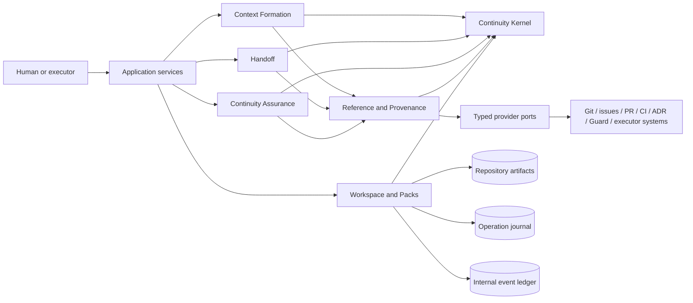
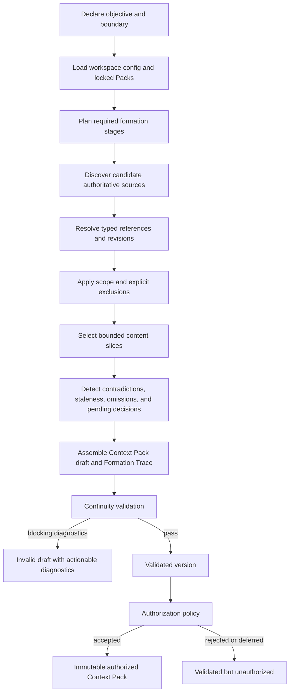

# Target Architecture

## 1. Purpose and decision status

> **PI-001 status notice**
>
> TA-001 is **provisional**. It was derived from the now-superseded interpretation that Context Packs and Handoffs define the complete product boundary. It is retained as historical architecture evidence, but it is **not authorized as an implementation or migration baseline**. The architecture must be revised through **TA-002 — Target Architecture Revision** before G3 can pass again.

This artifact records the L3 target architecture produced by TA-001 for the former product hypothesis:

> Repository-native, evidence-bound context and handoffs for resumable engineering work across humans and coding agents.

It remains useful as a classified architectural proposal and as evidence of decisions made under that interpretation. It no longer owns the active target baseline where it conflicts with the revised Product Foundation and `DR-0012`.

Exact CLI syntax, file serialization, UI, commercial packaging, and migration sequencing remain out of scope. No architecture redesign is performed in PI-001.

## 2. Authorization and governing constraints

### Observations

- Program State records G1 and G2 as passed.
- The validated Current Runtime Map is sufficient for target design; no additional Nestfolio source inspection was required.
- The current runtime implements broad policy, orchestration, backlog, learning, and agent-driver capabilities, while Context Pack and executor-neutral Handoff artifacts are absent.
- PF-001 rejected the broad control-plane boundary, the shared Commitment entity, and preservation of all current feature families as a target constraint.

### Binding constraints

The target architecture must:

- preserve external authority for work, code, policy, CI, incidents, execution, and organization catalogs;
- remain executor-neutral and usable by humans without agents;
- operate locally without a mandatory hosted service;
- survive session loss, executor replacement, process interruption, and context truncation;
- expose selected sources, authority, revisions, exclusions, uncertainty, pending decisions, and evidence provenance;
- keep Goal and Guard separate and externally referenced;
- keep irreversible, governance-changing, and judgment-based choices under explicit human authority policies;
- avoid a universal Console, generic workflow engine, generic task tracker, Guard registry, or learning system in the initial boundary.

## 3. Architectural thesis

### Decision

Continuity is a **local-first protocol and toolchain around two durable product-owned aggregates**:

1. **Context Pack** — the authorized, reproducible input contract for one bounded objective.
2. **Handoff** — the validated, durable output contract for continuation across a boundary.

The product also owns:

- schemas and lifecycle rules for those aggregates;
- continuity-specific validation reports and diagnostics;
- reproducible formation traces;
- local configuration and installed Pack definitions;
- append-only internal event history and recoverable operation state;
- typed references to external Goals, Guards, Decisions, Evidence, repositories, work items, and executor outputs.

It does **not** own the referenced external objects or the engineering work executed between a Context Pack and a Handoff.

### Architectural shape



The arrows point toward dependencies or invoked ports, not ownership of external state.

## 4. Epistemic and architectural vocabulary

- **Observation** — fact inherited from validated inputs or resolved provider evidence.
- **Decision** — target rule accepted by TA-001 and recorded here or in a Decision Record.
- **Proposal** — architecture direction not yet accepted.
- **Diagnostic** — continuity-specific finding; not a policy Guard or generic Observation entity.
- **Reference** — typed pointer to an authoritative object outside the owning aggregate.
- **Snapshot** — locally captured resolution metadata for a reference at one observed time and revision; never replaces the authority.
- **Internal event** — implementation-facing record of an accepted state change; not a public Event entity.
- **Operation** — one local command execution used for recovery and idempotency; not a public Run aggregate.

## 5. Bounded contexts

### 5.1 Context Formation

**Responsibility**

Form a bounded, explainable, reproducible Context Pack from declared objectives, repository state, selected external references, installed Packs, and explicit user choices.

**Owned state**

- `FormationRecord` — internal resumable record of formation stages, selected recipes, provider resolutions, diagnostics, and output digest;
- `ContextPack` — product-owned aggregate and its immutable versions;
- `FormationTrace` — selection rationale, source revisions, exclusions, Pack lock, and diagnostics used to produce a version.

**Does not own**

- source documents, issue state, CI results, executor memory, or policy definitions;
- backlog selection or engineering task planning;
- a generic knowledge base or RAG corpus.

### 5.2 Handoff

**Responsibility**

Capture and validate the minimum durable continuation contract at an interruption, session change, executor change, ownership change, or design-iteration boundary.

**Owned state**

- `Handoff` — product-owned aggregate and immutable versions;
- `TakeoverValidationReport` — evidence that the handoff is structurally ready and, when performed, that a successor could identify the next correct action without prior conversation.

**Does not own**

- work-item status, branch status, PR state, deployment state, or executor checkpoint;
- execution of pending work.

### 5.3 Reference and Provenance

**Responsibility**

Resolve typed references, establish authority and revision metadata, classify freshness, capture content digests or bounded excerpts where permitted, and report unresolved or contradictory references.

**Owned state**

- `ReferenceSnapshot` — derived resolution metadata keyed by reference identity, provider, observed revision, and digest;
- provider capability metadata and resolution cache;
- freshness and authority diagnostics.

**Does not own**

- the referenced Goal, Guard, Decision, Evidence, repository object, or work item;
- provider credentials as domain state.

### 5.4 Continuity Assurance

**Responsibility**

Validate only continuity contracts and their reproducibility:

- schema and lifecycle validity;
- required-field completeness;
- authority and revision presence;
- stale or unresolved references;
- contradictory canonical sources;
- unauthorized scope;
- missing exclusions or uncertainty;
- pending-decision visibility;
- output-contract completeness;
- Context Pack/Handoff consistency;
- takeover-readiness checks.

**Owned state**

- immutable `ValidationReport` and `Diagnostic` records;
- validator identities, versions, and deterministic result digests.

**Does not own**

- generic code quality, security, architecture, deployment, or policy assurance;
- a Guard registry or evaluator lifecycle for external policies.

### 5.5 Workspace and Packs

**Responsibility**

Provide local-first storage, installed Pack management, aggregate repositories, lock/lease management, indexes, internal event ledger, operation journal, and read models.

**Owned state**

- `WorkspaceConfig`;
- `PackDefinition` and `InstalledPack` lock state;
- aggregate snapshots and immutable artifact versions;
- local read indexes;
- operation journal;
- internal event ledger.

**Does not own**

- domain transition decisions for Context Packs or Handoffs;
- external authority state;
- organization-wide synchronization.

## 6. Continuity Kernel boundary

### Decision

The Continuity Kernel is a dependency-free domain nucleus shared by the bounded contexts. It is not a universal platform kernel and does not contain host integrations.

### Kernel contents

The Kernel may contain:

- identifiers, versions, digests, timestamps, and authority descriptors;
- `SourceReference` and specialized typed references:
  - `RepositoryReference`;
  - `GoalReference`;
  - `GuardReference`;
  - `DecisionReference`;
  - `EvidenceReference`;
  - `WorkReference`;
  - `ArtifactReference`;
- `Scope`, `Exclusion`, `Constraint`, `Uncertainty`, `PendingDecision`, and `OutputContract` value objects;
- Context Pack and Handoff state enums and transition guards;
- diagnostic severity and validation-result primitives;
- provider capability descriptors;
- internal command and event envelopes.

### Kernel exclusions

The Kernel must not contain:

- filesystem, Git, network, database, process, shell, model, or vendor SDK code;
- backlog, issue, PR, CI, incident, Guard, or executor aggregates;
- planner, worker, or orchestration engines for engineering work;
- a shared Goal/Guard base entity or `Commitment` schema;
- a public Lesson, Observation, Event, or Run aggregate;
- Console projections or application workflows;
- executable Pack plugins.

### Consequence

A new executor or provider can be integrated without changing Context Pack or Handoff semantics. A new external system adds an adapter and typed reference resolver rather than a new kernel entity.

Decision reference: `DR-0007`.

## 7. Aggregate and state model

### 7.1 Context Pack aggregate

A Context Pack version contains at minimum:

- stable pack identity and monotonically increasing version;
- objective statement plus optional external Goal or Work reference;
- repository/workspace identity and bound revision where applicable;
- authorized scope;
- explicit exclusions;
- constraints;
- selected authoritative sources and bounded content slices;
- applicable external Goal and Guard references without ownership;
- Decision references and unresolved `PendingDecision` entries;
- Evidence references with claim, authority, revision/run, scope, freshness, and reproducibility metadata;
- current continuation state relevant to the objective, without copying external workflow status as authority;
- known uncertainties and contradictions;
- output contract;
- Formation Trace and installed Pack lock;
- Validation Report references;
- authorization record and policy used.

#### Lifecycle

```text
draft → formed → validated → authorized → superseded
                  ↘ invalid
formed/validated/authorized → expired
```

- **draft** — objective exists; content may be incomplete.
- **formed** — formation pipeline completed and produced a reproducible trace.
- **validated** — Continuity Assurance found no blocking continuity diagnostics.
- **authorized** — the configured authorization policy accepted use of this exact version.
- **invalid** — validation completed with blocking diagnostics; a new version is required after correction.
- **expired** — freshness or revision policy no longer permits use without reformation.
- **superseded** — a newer version replaces it; history remains immutable.

An authorized version is immutable. Any content change creates a new version and reruns formation/validation as required.

### 7.2 Handoff aggregate

A Handoff version contains at minimum:

- stable handoff identity and version;
- source Context Pack reference and exact version, when one existed;
- boundary type: interruption, session, executor, owner, iteration, or explicit manual boundary;
- completed work summary, expressed as claims with references rather than duplicated external state;
- changed artifact references and repository revision;
- current continuation state and known partial work;
- pending work references, not an owned backlog;
- pending human decisions and Decision references;
- Evidence produced or invalidated;
- risks, contradictions, uncertainty, and failed approaches with diagnostic value;
- exact next objective;
- required inputs and explicit exclusions;
- output contract for the successor;
- readiness Validation Report;
- publication authority and timestamp.

#### Lifecycle

```text
draft → validated → published → superseded
          ↘ invalid
published → expired
```

- **validated** means structurally and referentially ready, not that the engineering work is correct.
- **published** freezes the version as a continuation boundary.
- Successor acceptance is Evidence linked to the Handoff, not a work-status transition owned by Continuity.

### 7.3 Pack Definition aggregate

A Pack Definition is a reusable, versioned formation and validation package. It is distinct from a Context Pack.

It contains:

- Pack identity, semantic version, digest, compatibility range, and publisher;
- declarative formation recipes;
- source selectors and bounded-slice rules;
- continuity validators and diagnostic metadata;
- templates and default output contracts;
- required provider capabilities;
- declared permissions and trust metadata;
- composition/conflict rules;
- supersession and deprecation metadata.

A Pack Definition must never contain live work state, copied authoritative evidence, or hidden provider credentials.

### 7.4 Reference Snapshot

A Reference Snapshot records what a provider observed:

- canonical URI or provider-native identifier;
- authority class;
- provider identity and version;
- observed revision/run/SHA/version;
- observed-at time;
- digest or immutable locator where available;
- freshness classification;
- access scope and resolution limitations;
- optional bounded excerpt or metadata allowed by policy.

It is derived and replaceable. Deleting the cache cannot delete the reference itself or change authority.

### 7.5 Pending Decision

`PendingDecision` is continuity metadata, not a Decision aggregate. It contains:

- the question requiring human authority;
- why continuation is blocked or risky;
- acceptable answer shape or choices where known;
- who or which external authority may decide;
- deadline/freshness when relevant;
- references to supporting Evidence;
- resolution status and, once resolved, a `DecisionReference`.

Continuity may request or record a decision reference. It may not silently decide governance-changing or judgment-based questions.

## 8. Commands, events, and transition authority

### 8.1 Command ownership

| Command | Owning context | Preconditions | Transition authority |
|---|---|---|---|
| `StartFormation` | Context Formation | objective and workspace identified | user, executor, or host invocation |
| `SelectSources` | Context Formation | applicable Pack recipes loaded | deterministic recipes plus explicit user choices |
| `ResolveReferences` | Reference and Provenance | typed references and provider capabilities declared | provider resolution; no authority transfer |
| `FormContextPack` | Context Formation | required resolution stages completed or diagnosed | Formation service |
| `ValidateContextPack` | Continuity Assurance | formed immutable candidate | Assurance service produces report; Formation owner applies transition |
| `AuthorizeContextPack` | Context Formation | validated version | configured authorization policy; human required where policy says so |
| `ExpireContextPack` | Context Formation | freshness/revision policy violated | deterministic policy or explicit human action |
| `SupersedeContextPack` | Context Formation | replacement version exists | explicit publisher/authorizer |
| `StartHandoff` | Handoff | a real continuation boundary is declared | user, executor, or host invocation |
| `CaptureHandoffState` | Handoff | source refs and current revision available | Handoff service; unresolved claims become diagnostics |
| `ValidateHandoff` | Continuity Assurance | immutable candidate | Assurance service produces report; Handoff owner applies transition |
| `PublishHandoff` | Handoff | validated version | configured publication authority |
| `SupersedeHandoff` | Handoff | replacement version exists | explicit publisher |
| `InstallPack` | Workspace and Packs | Pack identity, digest, compatibility, permissions known | explicit workspace owner action |
| `ResolvePendingDecision` | owning Context Pack/Handoff context | authoritative outcome available | human or external Decision authority; product binds reference only |
| `RebuildIndex` | Workspace and Packs | authoritative artifacts readable | deterministic infrastructure operation |
| `RecoverOperation` | Workspace and Packs | incomplete journal entry exists | deterministic recovery policy; human escalation on ambiguity |

### 8.2 Internal events

The initial internal event vocabulary includes:

- `FormationStarted`;
- `SourceSelected` / `SourceExcluded`;
- `ReferenceResolved` / `ReferenceUnresolved` / `ReferenceStale`;
- `ContextPackFormed` / `ContextPackValidated` / `ContextPackInvalidated` / `ContextPackAuthorized` / `ContextPackExpired` / `ContextPackSuperseded`;
- `HandoffStarted` / `HandoffValidated` / `HandoffInvalidated` / `HandoffPublished` / `HandoffExpired` / `HandoffSuperseded`;
- `PendingDecisionRecorded` / `PendingDecisionBoundToDecision`;
- `PackInstalled` / `PackRejected` / `PackSuperseded`;
- `OperationPaused` / `OperationResumed` / `OperationRecovered` / `OperationFailed`.

These events are internal contracts and audit records. They are not user-facing Event entities and are not used to model arbitrary engineering activity.

### 8.3 Transition rules

- Aggregate owners alone change aggregate lifecycle state.
- Assurance reports facts and diagnostics; it does not mutate artifacts directly.
- Providers resolve references; they do not authorize product transitions.
- Workspace persistence records accepted transitions; it does not infer them.
- Console and CLI issue commands through application services; they never write stores directly.
- An executor may propose content, but authorization and publication follow configured human-authority policies.
- A stale or contradictory authoritative source cannot be downgraded to a warning by a provider adapter; only the owning validation policy may classify severity, and the classification remains visible.

## 9. Local-first persistence and state authority

### 9.1 Decision

Product-owned durable authority is stored as human-inspectable, versioned repository artifacts. Local operational state is stored separately and is never the sole carrier of a pending decision, authorized Context Pack, or published Handoff.

Logical repository layout, with exact names and serialization deferred to implementation design:

```text
continuity-config
continuity-artifacts/
  context-packs/<id>/<version>
  handoffs/<id>/<version>
  validation-reports/<id>
  packs/<local-pack-id>/<version>
continuity-lock/
  packs-lock
local-state/                 # normally ignored by Git
  index
  reference-cache
  operation-journal
  event-ledger
```

### 9.2 Authority hierarchy

1. External systems remain authoritative for external objects.
2. Published/authorized repository artifacts are authoritative for product-owned Context Pack and Handoff state.
3. Validation Reports are authoritative only for the validation execution they identify.
4. Git history is provenance for committed artifact versions, not a substitute for explicit artifact lifecycle metadata.
5. Local indexes, caches, the operation journal, and event ledger are derived or operational state.
6. A hosted service, if added later, may replicate but must not silently override repository authority.

### 9.3 Immutable versions

- Authorized Context Packs and published Handoffs are immutable.
- Corrections create a new version and explicit supersession.
- Validation Report identity includes validator versions, Pack lock digest, artifact digest, and provider snapshot identities.
- Local edits to an immutable version are detected as digest mismatches and invalidate authorization/publication claims.

Decision reference: `DR-0008`.

## 10. Operation journal and internal event ledger

### 10.1 Operation journal role

The operation journal provides:

- crash recovery;
- idempotent stage execution;
- pause/resume around provider unavailability or pending human decisions;
- single-writer coordination per aggregate/version operation;
- replay of completed deterministic stages;
- explicit recovery status.

It is infrastructure state, not the public Run model and not the authority for aggregate content.

A pending human decision must also be materialized in the draft Context Pack or Handoff before the operation pauses. Loss of the local journal therefore cannot erase the fact that a decision is pending.

### 10.2 Event-ledger role

The event ledger records accepted internal domain events with:

- event identity and sequence;
- aggregate identity/version;
- command/operation identity;
- artifact digest before and after where applicable;
- actor/authorization policy;
- provider snapshot references;
- timestamp and result.

It supports audit, debugging, read projections, and recovery diagnostics. It is **not** the primary state store and does not justify event sourcing the product.

### 10.3 Commit ordering and recovery

Logical mutation sequence:

1. acquire operation lease;
2. journal command intent and expected prior digest;
3. validate command and transition;
4. write the new artifact version atomically;
5. append the committed internal event referencing the artifact digest;
6. update derived index;
7. mark operation complete and release lease.

Recovery rules:

- artifact written, event missing: reconstruct and append a recovery event after digest verification;
- event present, artifact missing: treat as incomplete/uncommitted and require recovery or human review; never project it as current state;
- torn journal or ledger record: retain the last valid record and emit a visible recovery diagnostic;
- index loss: rebuild from authoritative artifacts;
- ledger loss: rebuild a coarse history from artifact versions and Git provenance, while declaring any lost fine-grained operation history;
- conflicting writers: refuse the second writer; never merge lifecycle transitions by last-write-wins.

## 11. First-party modules

The target product contains these first-party modules. Module names are architectural roles, not final package names.

| Module | Responsibility | Bounded context | May depend on |
|---|---|---|---|
| `kernel` | domain value objects, lifecycle guards, command/event contracts | shared kernel | nothing outside kernel |
| `formation` | formation records, source selection, Context Pack aggregate | Context Formation | kernel, provider ports, aggregate repositories |
| `formation-planner` | deterministic stage and recipe planning for Context Formation only | Context Formation | kernel, Pack definitions |
| `handoff` | Handoff aggregate, capture and publication workflow | Handoff | kernel, provider ports, aggregate repositories |
| `reference-resolution` | typed resolution, snapshots, authority/freshness diagnostics | Reference and Provenance | kernel, provider ports, cache port |
| `continuity-assurance` | schema, completeness, contradiction, staleness, readiness validation | Continuity Assurance | kernel, read-only aggregate/reference ports |
| `pack-manager` | install, lock, compatibility, composition, conflict diagnostics | Workspace and Packs | kernel, artifact store, trust policy |
| `artifact-store` | atomic immutable-version persistence | Workspace and Packs | filesystem/database port only |
| `operation-journal` | resumable command-stage state and leases | Workspace and Packs | local persistence port |
| `event-ledger` | append-only internal transition/audit record | Workspace and Packs | local persistence port |
| `read-model` | derived local status and diagnostics | Workspace and Packs | artifact repositories, ledger, caches |
| `provider-host` | capability negotiation and adapter isolation | integration boundary | provider ports and adapters |
| `executor-export` | render authorized Context Pack/Handoff into executor-neutral bundles or declared adapter formats | integration boundary | kernel, read-only artifact repositories |
| `cli` | local command surface | product experience adapter | application services only |
| `local-console` | optional local projection and explainability surface | product experience adapter | application services/read model only |

### Not first-party product modules in the initial boundary

- generic backlog planner;
- engineering worker;
- multi-item or epic orchestrator;
- deploy/ship runner;
- generic Guard registry and evaluator engine;
- incident intake and rule minting;
- Lesson curation;
- organization analytics;
- universal engineering Console.

## 12. Dependency rules

1. `kernel` has no outward dependency.
2. Bounded-context domain/application modules depend only on the Kernel and declared ports.
3. Provider adapters depend inward on provider ports; domain modules never import adapters.
4. Filesystem, Git, shell, network, database, model, and vendor SDK code exist only in adapters/infrastructure.
5. Provider adapters do not depend on one another and cannot share provider-native objects across ports.
6. Workspace storage cannot infer domain transitions or rewrite external references.
7. Continuity Assurance is read-only over candidate artifacts and reference snapshots; it returns reports.
8. Console/CLI never access storage directly and never become an alternative authority.
9. Packs are declarative data. Executable extensions require separately installed, capability-declared providers and explicit permission.
10. Pack composition cannot override Kernel lifecycle states, authority semantics, or human-authority floors.
11. No generic “execute arbitrary command” provider is part of the domain contract.
12. Internal events cross bounded contexts only through application-level subscriptions with versioned contracts; no context reads another context's private tables/files.
13. External writes are absent from the initial provider surface. Integrations are read/resolve/export by default.
14. Any later external write capability requires a new Decision Record, explicit idempotency contract, and confirmation that it does not create a second source of truth.

Decision reference: `DR-0009`.

## 13. Provider contracts

### 13.1 Common provider envelope

Every provider declares:

- provider identity and version;
- supported typed capabilities;
- authority classes it can resolve;
- access scope and required permissions;
- deterministic/non-deterministic behavior;
- freshness and rate-limit semantics;
- content trust classification;
- reproducibility guarantees and limitations.

Every resolution returns either a typed result or typed failure. A successful result includes canonical identity, observed revision, observed time, digest/immutable locator where available, and resolution limitations.

### 13.2 Initial provider ports

| Port | Read responsibility | Explicit exclusions |
|---|---|---|
| `RepositorySourceProvider` | repository identity, revision, tree/blob metadata, bounded content slices, diff metadata | no commit, branch, merge, or code mutation |
| `WorkReferenceProvider` | resolve issue/project Goal or work item and selected metadata | no backlog import, prioritization, or status mutation |
| `DecisionReferenceProvider` | resolve ADR, approval, review decision, or repository Decision Record | no autonomous decision-making |
| `EvidenceReferenceProvider` | resolve CI run, test report, PR check, build, attestation, or external artifact metadata | no evidence copying by default and no CI execution |
| `GuardReferenceProvider` | resolve external Guard/policy identity, applicability metadata, and latest outcome when available | no Guard lifecycle or evaluator ownership |
| `OwnershipProvider` | resolve repository/path/team ownership metadata for scope diagnostics | no organization catalog ownership |
| `ExecutorExportProvider` | render or deliver an authorized pack/handoff in a declared executor format | no durable execution checkpoint ownership |
| `ClockIdentityProvider` | actor identity and trustworthy time for local records | no organization IAM ownership |

### 13.3 Provider safety

- Resolved content is treated as data, never as trusted executable instruction.
- Instructions embedded in source content are labeled by source and authority and cannot alter provider permissions or formation policy.
- Bounded excerpts preserve provenance and delimit untrusted text for executor export.
- Provider output that omits revision/authority metadata cannot silently satisfy a required authoritative source.
- Non-deterministic judgment providers may propose diagnostics but cannot alone authorize a Context Pack, publish a Handoff, or resolve a human Decision.

## 14. Pack model

### 14.1 Decision

Separate **Pack Definitions** from **Context Packs**.

- A Pack Definition is reusable product configuration: recipes, selectors, validators, templates, and capability requirements.
- A Context Pack is a concrete, versioned continuation artifact for one objective.

Decision reference: `DR-0010`.

### 14.2 Composition order

Pack composition is explicit and locked:

1. mandatory core Pack;
2. explicitly installed first-party Packs;
3. explicitly installed project/team Packs;
4. invocation-selected recipes;
5. explicit user overrides allowed by schema.

The resulting lock records every Pack identity, version, digest, provider requirement, and override.

### 14.3 Conflict behavior

- Conflicting required fields, selectors, authority rules, or validators produce blocking diagnostics.
- There is no silent last-write-wins composition.
- A lower-trust Pack cannot relax a higher-trust mandatory validation rule.
- A project Pack may add scope constraints or required sources but cannot redefine Kernel semantics.

### 14.4 Initial first-party Packs

The architecture permits, but does not require all at first release:

- core repository continuity;
- long migration/refactor;
- executor switch;
- design iteration;
- human ownership transfer;
- monorepo/path-scoped continuation;
- GitHub/GitLab reference integration;
- CI/PR Evidence reference integration.

Starter Packs are adoption aids. They are not an excuse to recreate Nestfolio's general Guard library.

## 15. Context Formation subsystem

### 15.1 End-to-end pipeline



### 15.2 Formation stages

1. **Frame objective** — capture objective, boundary type, expected output, and optional external Work/Goal reference.
2. **Bind workspace** — identify repository/workspace and current revision.
3. **Load recipes** — resolve Pack lock and provider capabilities.
4. **Discover candidates** — enumerate only sources permitted by recipes, user choices, and scope.
5. **Resolve authority** — establish canonical identity, revision, freshness, and access limitations.
6. **Select and explain** — include bounded slices and record why each source was selected.
7. **Exclude explicitly** — record deliberate exclusions and why they are safe or necessary.
8. **Diagnose** — identify unresolved refs, contradictions, stale state, missing owners, missing evidence, and likely omissions.
9. **Assemble** — create the Context Pack and Formation Trace.
10. **Validate** — run deterministic continuity validators and declared judgment diagnostics.
11. **Authorize** — apply the configured policy to freeze the version for use.
12. **Export** — render an executor-neutral bundle or adapter-specific view without changing the canonical artifact.

### 15.3 Reproducibility

A formation is reproducible when another installation can obtain equivalent selected identities and diagnostics from:

- workspace/repository identity and revision;
- Pack lock and validator versions;
- typed provider references;
- source selection and exclusion trace;
- bounded-slice locators/digests;
- explicit user choices;
- authorization policy identity.

Exact byte-for-byte source retrieval may be impossible for mutable external systems. In that case, the formation must state the limitation and preserve the strongest immutable locator or digest available.

### 15.4 Omission handling

The subsystem must not claim completeness. It produces one of:

- no known blocking omission under the declared recipes and available authority metadata;
- known missing source/provider/permission;
- contradictory canonical sources;
- scope ambiguity;
- probable omission requiring human review;
- intentionally excluded source with rationale.

A “validated” Context Pack means the declared continuity contract passed known validators, not that all relevant knowledge in the world is present.

Decision reference: `DR-0011`.

## 16. Handoff workflow

1. Declare the real continuation boundary and source Context Pack, if any.
2. Bind current repository revision and external work references.
3. Capture completed and partial work as claims with changed-artifact and Evidence references.
4. Record invalidated assumptions, failed approaches with diagnostic value, and newly discovered constraints.
5. Record every unresolved human Decision and responsible authority.
6. State the exact next objective, required inputs, and explicit exclusions.
7. Validate that references resolve, revisions are coherent, no blocking decision is hidden, and the next action is identifiable.
8. Publish an immutable Handoff version.
9. A successor forms a new Context Pack from the Handoff plus current authoritative state; it does not merely replay the old prompt.
10. Optional takeover validation records Evidence that the successor identified the correct next action and material constraints without prior conversation.

A Handoff is not a transcript summary. Conversation text may be cited only when deliberately promoted into a canonical artifact or Evidence reference.

## 17. Failure and recovery behavior

| Failure mode | Required behavior | Recovery authority |
|---|---|---|
| Required provider unavailable | pause operation; persist diagnostic and pending requirement; do not fabricate content | retry or human chooses an explicit degraded path |
| Permission denied | report inaccessible authority and affected claims; never treat absence as nonexistence | user/provider administrator |
| Reference unresolvable | block when required; warn only under declared policy | owning validation policy plus explicit authorization |
| Mutable source changed during formation | bind observed revision/digest; invalidate or restart affected stages | Formation service |
| Contradictory canonical sources | preserve both references and block authorization unless an explicit Decision resolves authority | human Decision authority |
| Pack conflict or incompatible version | block formation before source selection; show exact conflicting rules | workspace owner changes Pack lock |
| Probable material omission | expose diagnostic and selected-source explanation; no false completeness claim | human review or additional recipe/provider |
| Judgment evaluator unavailable or inconsistent | retain deterministic results; mark judgment diagnostic unavailable/unstable | human authority; no silent pass |
| Embedded prompt injection or hostile instructions | treat source as untrusted data, preserve delimiters/provenance, ignore attempts to alter policy/capabilities | provider host and export policy |
| Context Pack edited after authorization | digest mismatch invalidates authorization; require new version | Context Formation owner |
| Handoff edited after publication | digest mismatch invalidates publication; require new version | Handoff owner |
| Interrupted operation | resume from operation journal; replay completed idempotent stages | Workspace recovery service |
| Concurrent writers | reject second writer; show lease owner and recovery options | workspace owner after stale-lease verification |
| Torn journal/ledger record | retain last valid record and emit recovery diagnostic | Workspace recovery service |
| Artifact write succeeded but ledger append failed | artifact remains authority; append recovery event after digest verification | Workspace recovery service |
| Ledger event exists without artifact | do not project event as state; recover or mark abandoned | Workspace recovery service/human on ambiguity |
| Local index/cache loss | rebuild from artifacts and providers; declare unresolved snapshots | deterministic rebuild |
| Executor rejects or cannot consume export | canonical artifact remains valid; adapter-specific export fails visibly | select another adapter or correct adapter |
| External Goal/Guard/Evidence becomes stale after publication | mark pack/handoff expired or stale under policy; preserve original observed snapshot | deterministic freshness policy plus reformation |

## 18. Placement of planner, worker, orchestrator, journal, assurance, trust, learning, and console

| Capability | Target placement | Decision |
|---|---|---|
| Planner | `formation-planner` inside Context Formation | Plans formation stages and source requirements only; no backlog prioritization or engineering plan ownership. |
| Worker | External human/coding executor | Continuity exports authorized context and accepts evidence/handoff inputs; it does not execute engineering work. |
| Orchestrator | External agent runtime, workflow engine, or project process | Continuity does not own multi-item, epic, deploy, or merge orchestration. |
| Journal | Workspace infrastructure | Resumes internal formation/handoff/provider operations only; not a public Run or workflow authority. |
| Assurance | Continuity Assurance bounded context | Validates continuity contracts only; code/security/policy assurance remains external Evidence/Guard authority. |
| Trust | Cross-cutting result of provenance, immutable versions, explainable selection, visible uncertainty, validation, and human authorization | No separate opaque “Trust engine” or score. |
| Learning | Outside initial product boundary | Handoff outcomes and diagnostics may later support experiments; no Lesson entity, rule minting, or curation lifecycle now. |
| Console | Optional local product-experience adapter | Projects Context Packs, Handoffs, diagnostics, references, and recovery state; never a universal engineering Console or source of truth. |

## 19. Complete current-to-target mapping

Disposition vocabulary:

- **retain-core** — directly supports the narrow target and becomes product-owned;
- **narrow-adapt** — reuse the architectural capability only for continuity contracts;
- **reference-external** — external system remains authoritative; target stores typed references/snapshots;
- **externalize** — execution belongs outside Continuity;
- **defer** — not in initial target, requires later evidence and Decision;
- **reject-initial** — intentionally excluded from the initial product boundary.

| Current feature family | Target disposition | Target home or external authority | Mapping rationale |
|---|---|---|---|
| Check schema and registry | narrow-adapt | Continuity Assurance + Pack Definitions | Retain versioned validators for continuity artifacts, not a generic Guard registry. |
| Finding schema and attribution | narrow-adapt | Continuity Assurance diagnostics | Findings become continuity diagnostics with validator/source provenance. |
| Evaluator dispatch (`cmd`, `module`, `eslint`, `skill`) | narrow-adapt | Validator/provider host | Deterministic validators are bounded; judgment is explicit and human-authorized; no arbitrary generic evaluator surface. |
| Scope selection and global invariants | retain-core | Context Formation + Continuity Assurance | Scope, exclusions, and mandatory continuity rules are central. |
| Registry self-check and rot detection | narrow-adapt | Pack manager + Assurance | Validate Pack compatibility, validator identity, and stale definitions. |
| Trigger/cadence selection engine | externalize | Git hooks/CI/schedulers invoke Continuity | Product exposes commands; it does not own cadence scheduling. |
| Commit gate | reference-external / optional narrow hook | Git hook may validate Continuity artifacts only | Generic code policy remains external. |
| Ship branch-delta recheck | reference-external | CI/PR Evidence provider | Ship status and checks remain authoritative in delivery systems. |
| Boundary start/ship gate | narrow-adapt | Pack authorization and Handoff publication boundaries | Replace engineering gates with continuity lifecycle validation. |
| SHA-conditional expensive batch | narrow-adapt | revision-bound formation/validation | Re-run expensive resolution/validation only when relevant source revisions change. |
| Deploy and affected integration gate | externalize | CI/CD and deployment systems | Continuity references outcomes; no deploy ownership. |
| Actual E2E test execution in deploy/pre-done runner | externalize | CI/test systems | Referenced as Evidence only. |
| Git-native journal, replay, park, fulfil | retain-core concept | Operation journal | Reuse resilience and idempotency for internal product operations, not engineering execution. |
| Runtime-path provenance journaling | retain-core concept | Formation Trace + event ledger | Generalize to provider, Pack, revision, command, and artifact provenance. |
| Single-item worker spine | externalize | coding agent/human workflow | Work execution is outside product authority. |
| Generic `run-item` driver | narrow-adapt | executor export/adapter | Adapter consumes Context Pack or emits Handoff; it does not own item execution state. |
| Epic core-member orchestrator | externalize | issue/project system or workflow runtime | Multi-item orchestration is outside initial boundary. |
| Parallel `fanOut` capability | reject-initial | external executor runtime | No demonstrated continuity-specific need. |
| In-process `onTrigger` capability | externalize | host integration | Hosts invoke product commands through stable interfaces. |
| Finding-to-backlog intake | reject-initial | issue/incident systems | Diagnostics may link to external work but do not create or route backlog by default. |
| Backlog next planner and computed impact | reject-initial | issue/project systems | Replaced only by formation planning, not work prioritization. |
| Operational read model and executor | narrow-adapt | local read model + CLI/Console | Shows continuity artifacts, diagnostics, pending decisions, and recovery state only. |
| Theme clustering | reject-initial | issue/knowledge systems | Not required for Context Pack/Handoff wedge. |
| Captured-member leftovers spin-out | reject-initial | issue/project systems | Work decomposition remains external. |
| Dossier related-workstream reconciliation | reject-initial | issue/knowledge systems | No product-owned dossier or workstream graph. |
| Check minting and ratification | reject-initial | external policy/PR governance | No automatic Guard lifecycle in initial product. |
| Check keep/retire/supersede curation | reference-external | Guard/policy provider | Can detect stale references, not curate external Guards. |
| Ship-time mint consideration | reject-initial | incident/review/policy tools | Learning-to-rule loop remains external. |
| Judgment audit procedure binding | narrow-adapt | continuity judgment diagnostics + human authority | Used only to diagnose continuity quality; never creates false enforcement authority. |
| Scheduled audit artifact production | narrow-adapt | external scheduler invokes continuity validation | Reports local diagnostics; cadence stays external. |
| Merge-trigger enforcement | externalize | source-control/CI | Optional integration can require a valid Handoff/Pack without owning merge. |
| Starter-pack initialization | retain-core | Pack manager | Becomes installable declarative first-party Pack definitions. |
| Advertised six-check starter pack | replace | Pack lock and self-validation | Version/digest/contents must be reproducible; documentation drift is a blocking Pack diagnostic. |
| Public CLI `watch` and `next` delegation | replace | product-experience adapter | Future CLI must issue real application commands; no work-planning `next`. |
| Direct single-check CLI | narrow-adapt | continuity validator invocation | Allows targeted continuity validation, not arbitrary project Guard execution. |
| Direct watch CLI | narrow-adapt | validate changed continuity artifacts/references | No generic policy watch engine. |
| Evaluation scenario grader | narrow-adapt | protocol validation and takeover experiments | Retain for product falsification, Pack validation, and dogfood scenarios. |
| Context Pack as a runtime artifact | retain-core | Context Formation | New principal aggregate. |
| Executor-neutral Handoff as a runtime artifact | retain-core | Handoff | New principal aggregate. |
| Evidence Reference abstraction | retain-core | Kernel + Reference and Provenance | Generalize distributed evidence-like fields into typed references. |
| Decision as a durable first-class artifact | narrow-adapt | `PendingDecision` + external/local `DecisionReference` | Product exposes pending decisions but does not own all decision systems. |
| Run as operational state | narrow-adapt / not public | operation journal IDs | No public Run aggregate until executor-neutral necessity is proven. |
| Goal as runtime-owned state | remain absent | external Work/Goal provider | Preserve external authority. |
| Guard as current behavior | reference-external | external Guard/policy provider | Preserve separation and external lifecycle authority. |
| Commitment shared entity/schema | remain absent | none | Explicitly rejected by DR-0005. |
| Observation public object | remain absent | diagnostic/epistemic label only | No initial public lifecycle. |
| Lesson dossier and check backlink | reject-initial | incident/ADR/review systems | Reference existing findings and rationale rather than own Lesson curation. |
| Generic event object/store | remain absent publicly | internal event ledger only | Events are implementation contracts, not user objects. |
| Generic context-formation subsystem | retain-core | Context Formation | New end-to-end bounded context. |
| Exact Git revision binding for this inventory | retain-core/generalize | Repository provider + Reference Snapshots | Every repository-bound Pack/Handoff records revision and strongest available digest. |

### Current ring/module disposition

| Current area | Target disposition |
|---|---|
| `runtime/engine/schema` | concepts selectively re-expressed in Kernel and aggregate schemas; no direct schema compatibility promise |
| `runtime/engine/capabilities` | replaced by narrow typed provider ports; remove generic execution capabilities |
| `runtime/engine/lib` | journal/provenance/scope concepts may inform new modules; backlog, Guard, themes, deploy, and generic watch behavior are not target-owned |
| `runtime/engine/loop` | engineering worker/orchestrator externalized; no target loop compatibility promise |
| `runtime/engine/backward` | rejected from initial boundary; later integration hypothesis only |
| `runtime/adapters/claude-code` | replaced by executor-neutral export plus optional vendor adapters |
| `runtime/adapters/git` | optional invocation/evidence adapters; not generic policy authority |
| `runtime/content` | Nestfolio project content remains in Nestfolio; not copied into target product |
| `runtime/starter` | concept becomes declarative Pack Definitions after protocol stabilizes |
| `runtime/eval` | adapt to continuity protocol and takeover validation scenarios |

No current implementation module is declared reusable code by TA-001. Reuse decisions belong to migration architecture after G4.

## 20. Scenario stress tests

### Scenario 1 — Single developer with one coding agent

**Result:** supported only for long, interruption-prone tasks. The local-first core imposes no backlog migration and can produce a diagnostic instead of forcing ritual artifacts. Formation/Handoff authoring cost remains a product-experience risk.

### Scenario 2 — Small team with CI and GitHub Issues

**Result:** supported. Work and CI stay authoritative; Context Packs/Handoffs use typed references. No shadow issue status exists. Provider outage or stale references are visible.

### Scenario 3 — Large regulated organization

**Result:** intentionally not an initial architecture target. The model can preserve provenance but does not add centralized RBAC, retention, cross-org catalog, or audit-system authority. A hosted governance layer would require later Decisions.

### Scenario 4 — Monorepo with multiple teams

**Result:** supported conditionally. Formation recipes can use path scope, ownership providers, explicit exclusions, and contradiction diagnostics. The architecture cannot guarantee omission-free dependency discovery; that limitation remains visible.

### Scenario 5 — Incident produces a recurring prevention rule

**Result:** not owned. Handoffs may reference incident Evidence, external follow-up Goals, and external Guards. Rule creation, calibration, enforcement, and retirement remain in incident/policy systems.

### Scenario 6 — Judgment-based architectural review

**Result:** supported as references and pending human authority, not as uniform Guard enforcement. A judgment provider may produce a continuity diagnostic, but architecture approval remains an external Decision.

### Scenario 7 — Long migration interrupted across sessions

**Result:** strongest fit. Revision-bound Context Packs, immutable Handoffs, explicit exclusions, Evidence references, pending Decisions, and operation recovery directly address the scenario without copying issue or migration-plan authority.

### Scenario 8 — Executor changes mid-work

**Result:** strongest fit. The canonical artifacts are executor-neutral; vendor adapters only render/export. Hidden executor state is explicitly non-authoritative and must be surfaced into a Handoff or accepted as unavailable.

### Scenario 9 — Contradictory or obsolete Guard

**Result:** no Guard lifecycle ownership. Reference resolution can report stale, missing, or contradictory Guard references in a Context Pack, but retirement/supersession belongs to the Guard authority.

### Scenario 10 — Human rejects an automatically proposed Guard

**Result:** not a product workflow. A proposal can be referenced as external work/Decision evidence; Continuity does not mint or activate the Guard.

### Scenario 11 — No-agent adoption

**Result:** supported by the same repository artifacts and human-readable validation. Executor adapters are optional. Product experience must keep authoring cost low enough for infrequent human handoffs.

### Scenario 12 — Dogfood Context Formation

**Result:** directly supported. Continuity's own repository can lock canonical inputs, validate exclusions, detect artifact contradictions, publish handoffs, and measure takeover quality. Dogfood remains feasibility evidence, not market validation.

## 21. Rejected alternatives

### Rebuild the current Nestfolio runtime as the target

Rejected because it restores the broad control-plane boundary and makes implementation breadth product authority.

### One universal Continuity aggregate

Rejected because Context Pack, Handoff, Goal, Guard, Decision, Evidence, and Run have different authority and lifecycle semantics.

### Event-sourced primary state

Rejected. An event ledger is useful for audit and recovery, but repository artifacts must remain inspectable primary authority. Event sourcing would complicate local editing, Git review, and recovery without proven value.

### Generic provider with arbitrary shell/tool execution

Rejected because it collapses dependency boundaries, weakens reproducibility, and enables source content or Packs to escalate capabilities.

### Mandatory hosted control plane

Rejected because initial value must be local-first and repository-native.

### Universal engineering Console

Rejected because it would duplicate issue, CI, policy, incident, catalog, and executor authorities.

### Product-owned Goal, Guard, Lesson, or backlog state

Rejected for the initial boundary under DR-0005 and DR-0006.

### Silent automatic Context Pack authorization

Rejected as a universal rule. Authorization is explicit and policy-driven; judgment-based or governance-sensitive scope requires human authority.

## 22. Open questions and deferred trade-offs

These questions do not block G3 because ownership and dependency boundaries are already explicit:

1. **Physical serialization and paths** — exact YAML/JSON/Markdown representation and directory names belong to implementation design.
2. **Default authorization policy** — product experience must define when validated Packs/Handoffs require explicit confirmation versus a configured deterministic policy.
3. **Takeover validation protocol** — exact successor comprehension test and acceptable cost require L4/L7 design and experiments.
4. **Omission diagnostics** — initial validator set, confidence language, and acceptable false-positive/false-negative rates require validation evidence.
5. **Public `Run` concept** — remains excluded unless experiments prove executor-neutral necessity beyond operation IDs and Handoff boundaries.
6. **Pack trust and distribution** — signing, publisher trust, sandboxing, and registry UX require later security and product-experience work.
7. **Reference caching policy** — retention, encrypted local storage, redaction, and offline behavior vary by provider and need implementation policy.
8. **Hosted collaboration** — optional replication, team review, analytics, and access control are deferred until local value is proven.
9. **External write adapters** — absent initially; any later issue/PR/CI mutation requires a new Decision Record.
10. **Migration reuse** — no current Nestfolio module is approved for direct reuse until migration analysis evaluates extraction cost and compatibility.
11. **Console scope** — L4 must prove that a local Console adds value beyond CLI and repository files without becoming a second authority.
12. **Learning metrics** — takeover outcomes may be measured, but no Lesson lifecycle or automatic rule creation is authorized.

## 23. G3 assessment

**Historical TA-001 result:** G3 was recorded as passed on 2026-07-13 against the former Product Foundation.

**Current PI-001 result:** G3 is reopened.

The TA-001 coherence assessment remains evidence that the architecture was internally coherent for the narrow Context Pack/Handoff interpretation. It does not establish coherence against the revised repository-native agentic-development framework, which now includes work selection, skills, repository-local work state, resumable Runs, Guards, and learning as legitimate product concerns.

TA-001 is therefore provisional and not an implementation baseline. **TA-002 — Target Architecture Revision** must reassess bounded contexts, authority, lifecycle, adapters, Packs, current-feature classification, and the complete operational loop.
